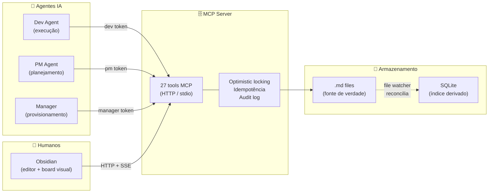

# ObsidianKan

**Um sistema Kanban para agentes de IA e humanos — com a confiabilidade de um banco de dados e a simplicidade de arquivos Markdown.**

ObsidianKan transforma um vault Obsidian em um sistema Kanban operacional que agentes e humanos usam simultaneamente, sem conflito. É um servidor MCP com 27 ferramentas, controle de acesso por papel, idempotência, optimistic locking e um plugin Obsidian para visualização em tempo real.

---

## Como funciona

Cards são arquivos `.md` no vault — editáveis por qualquer pessoa no Obsidian. O servidor MCP fica na frente e oferece aos agentes uma interface estruturada, segura e auditável para ler e escrever esses cards.



---

## Estrutura do monorepo

```
packages/
  server/    # MCP Server — Node.js, TypeScript, better-sqlite3
  plugin/    # Plugin Obsidian — TypeScript + esbuild
  shared/    # Tipos compartilhados (@obsidiankan/types)
scripts/     # sprint-workflow.ts — orquestrador autônomo
docs/        # Documentação organizada por público
```

**Stack:** Node.js ≥22, TypeScript 5.6, better-sqlite3, MCP SDK 1.29+, chokidar, pino, Anthropic SDK

---

## Quick start

### 1. Instalar e compilar

```bash
git clone <repo-url> obsidiankan && cd obsidiankan
~/.local/share/pnpm/bin/pnpm install
~/.local/share/pnpm/bin/pnpm run build
```

### 2. Configurar

```bash
cp .env.example .env
# Edite .env: defina VAULT_PATH=/caminho/para/seu/vault
```

### 3. Executar

```bash
VAULT_PATH=/caminho/para/vault node packages/server/dist/index.js
```

### 4. Verificar

```bash
curl http://127.0.0.1:9375/health
# → {"status":"ok"}
```

> Veja o guia completo em [docs/for-users/getting-started.md](docs/for-users/getting-started.md)

---

## Tipos de agente e controle de acesso

O sistema tem três níveis de acesso, controlados por tipo de token. Cada agente recebe apenas as ferramentas que pode chamar — a lista é filtrada no momento da conexão.

| Papel | Acesso | Responsabilidade |
|---|---|---|
| **Manager** | Todos os 27 tools | Cria projetos e minta tokens |
| **PM** | 24 tools (sem admin) | Cria cards, gerencia sprints, supervisiona review |
| **Dev** | 13 tools | Executa cards: claim, move, log, pick_next |

Veja a matriz completa em [docs/for-agents/tool-catalog.md](docs/for-agents/tool-catalog.md).

---

## Garantias de consistência

| Garantia | Mecanismo |
|---|---|
| **Escritas atômicas** | `.tmp → rename` — sem arquivos parcialmente escritos |
| **Versioning** | Todo card tem `version`. Conflito retorna `409` com estado atual |
| **Idempotência** | `request_id` opcional em toda mutação — retry seguro |
| **SQLite reconstruível** | Pode ser deletado; o servidor reconstrói dos `.md` no startup |
| **Audit log** | Toda mutação gravada em `audit.ndjson` (append-only) |

---

## Documentação

### Para usuários
- [Primeiros passos](docs/for-users/getting-started.md) — instalação, configuração, execução
- [Troubleshooting](docs/for-users/troubleshoot.md) — erros comuns e soluções

### Para desenvolvedores
- [Setup de desenvolvimento](docs/for-developers/setup.md) — monorepo, build, dev mode
- [Arquitetura](docs/for-developers/architecture.md) — diagramas C4, fluxos, padrões
- [Guia de testes](docs/for-developers/testing.md) — como rodar e adicionar testes
- [Contribuição](docs/for-developers/contributing.md) — convenções, PR process

### Para agentes IA
- [Runbook do agente](docs/for-agents/agent-runbook.md) — mint tokens, configurar clientes
- [Catálogo de tools](docs/for-agents/tool-catalog.md) — referência das 27 ferramentas MCP
- [Guia de integração](docs/for-agents/integration-guide.md) — wire protocol, auth, SSE
- [Sprint workflow](docs/for-agents/sprint-workflow.md) — workflow autônomo de sprint

### Referência
- [Configuração](docs/reference/config.md) — variáveis de ambiente, .mcp.json, estrutura do vault
- [Design](docs/reference/design/) — class diagrams, invariants
