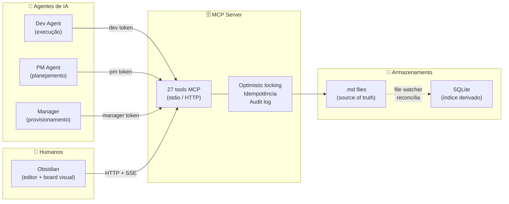
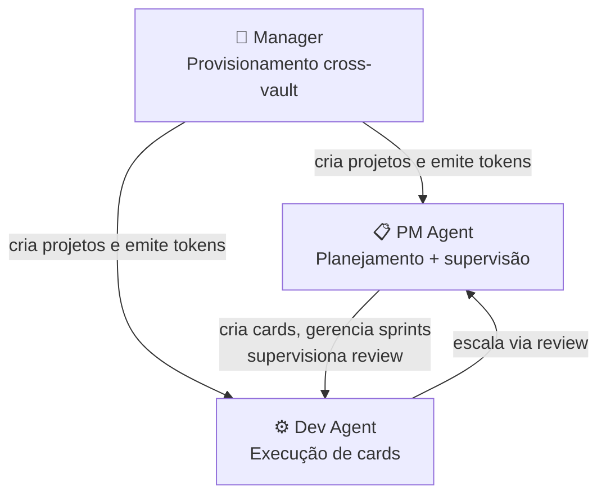
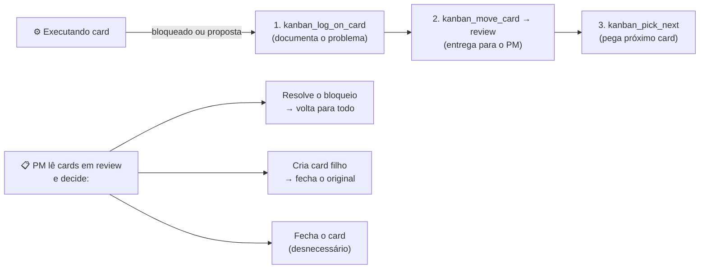
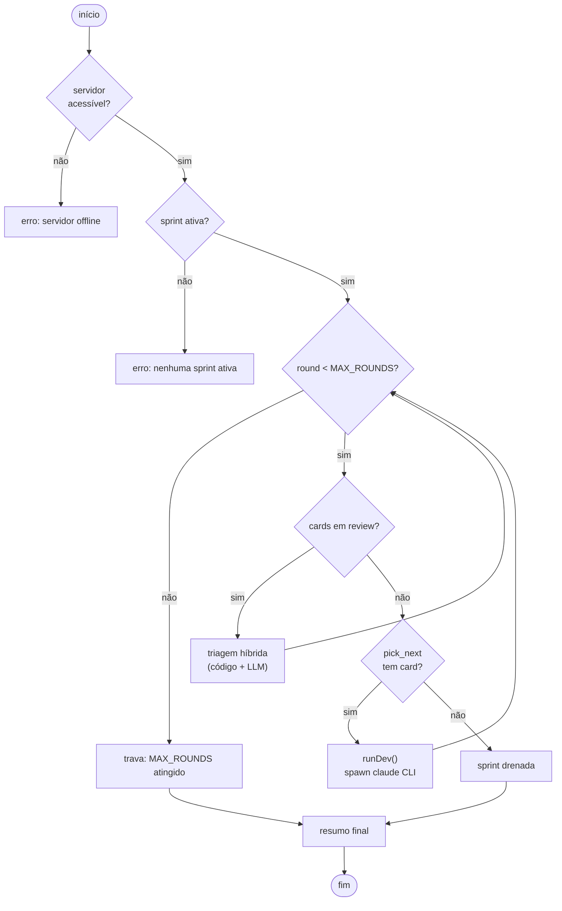
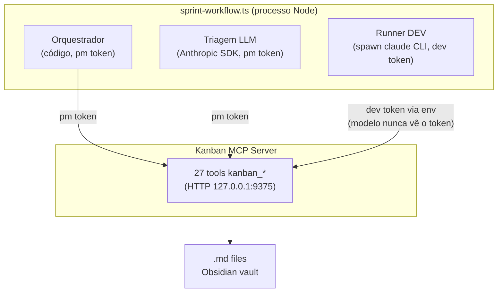
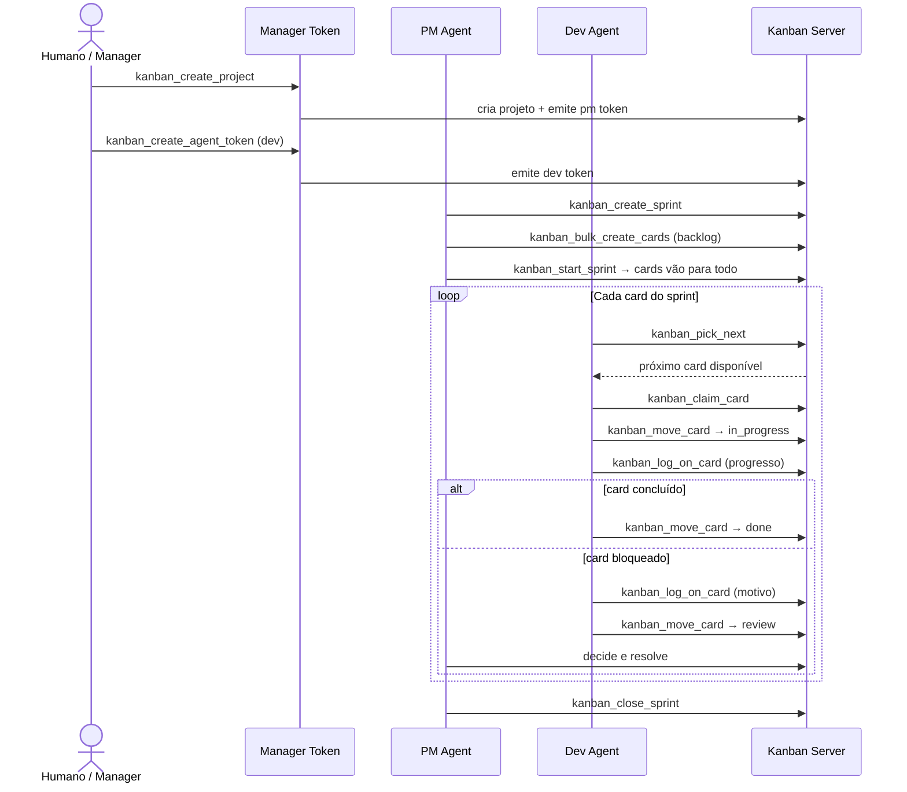

# ObsidianKan MCP

**Um board Kanban para agentes de IA e humanos — com a confiabilidade de um banco de dados e a simplicidade de arquivos Markdown.**

ObsidianKan transforma um vault do Obsidian em um sistema Kanban operacional que agentes e humanos usam simultaneamente, sem conflito.

---

## O problema

Agentes de IA são cada vez mais capazes de gerenciar tarefas longas — mas não têm um lugar confiável para rastrear trabalho compartilhado com humanos.

A maioria das configurações força uma escolha:

- **Usar um gerenciador de tarefas** — agentes não escrevem nele nativamente, integrações quebram, humanos perdem o workspace familiar
- **Usar arquivos simples** — sem estrutura, sem controle de concorrência, sem consistência quando múltiplos agentes escrevem ao mesmo tempo

O resultado: agentes alucinam estado de tarefas, duplicam trabalho ou sobrescrevem mudanças uns dos outros silenciosamente.

---

## A solução

ObsidianKan é um servidor MCP construído sobre um vault do Obsidian. Cards são arquivos `.md` — legíveis e editáveis por qualquer pessoa. Um servidor MCP leve fica na frente e dá aos agentes uma interface estruturada, segura e auditável para ler e escrever esses cards.

Humanos continuam usando o Obsidian normalmente. Agentes chamam tools MCP. Ambos os caminhos de escrita são suportados e reconciliados automaticamente.



---

## Por que funciona

**Cards são só arquivos Markdown.**
Sem formatos proprietários. Humanos leem, editam e anotam qualquer card direto no Obsidian. O sistema abraça isso em vez de lutar contra.

**Agentes escrevem por uma interface disciplinada.**
O servidor valida cada escrita de agente: tipos de campo, existência de coluna, conflitos de versão. Agentes recebem erros claros — não falhas silenciosas.

**Conflitos são explícitos e recuperáveis.**
Cada card tem uma versão inteira. Se dois agentes tentam atualizar o mesmo card, um recebe `409 Conflict` com o estado atual e a lista de campos conflitantes.

**Retries são seguros por design.**
Toda operação mutante aceita um `request_id`. Se um agente retenta após timeout, o servidor retorna a resposta original sem criar duplicata.

**Nada é perdido.**
SQLite é um índice derivado. Se deletado, o servidor o reconstrói a partir dos `.md` files no próximo startup.

**Tudo é auditado.**
Toda mutação — escrita de agente, edição humana, reversão de campo — produz uma entrada no audit log imutável.

---

## Tipos de agente

O sistema tem três níveis de acesso, controlados pelo tipo de token. **Cada agente só recebe as tools que pode chamar** — a lista é filtrada no momento da conexão.



### Tabela de tools por tipo de agente

| Tool | Descrição | Dev | PM | Manager |
|------|-----------|:---:|:--:|:-------:|
| **Cards** |
| `kanban_list_cards` | Lista cards com filtros; dev sempre limitado ao sprint ativo | ✅ | ✅ | ✅ |
| `kanban_get_card` | Busca um card completo (com corpo) | ✅ | ✅ | ✅ |
| `kanban_log_on_card` | Adiciona entrada de log ao card (markdown + mermaid suportados) | ✅ | ✅ | ✅ |
| `kanban_move_card` | Move card entre colunas; aceita input/output tokens para custo | ✅ | ✅ | ✅ |
| `kanban_claim_card` | Reivindica o card para si; 409 se já pertence a outro agente | ✅ | ✅ | ✅ |
| `kanban_release_card` | Libera o card; volta para `todo` por padrão | ✅ | ✅ | ✅ |
| `kanban_create_card` | Cria card (title, type, sprint_id obrigatórios) | ❌ | ✅ | ✅ |
| `kanban_bulk_create_cards` | Cria até 100 cards em uma chamada; resposta split created/failed | ❌ | ✅ | ✅ |
| `kanban_update_card` | Atualiza campos do card com optimistic locking | ❌ | ✅ | ✅ |
| `kanban_reorder_card` | Reordena card dentro da coluna | ❌ | ✅ | ✅ |
| `kanban_delete_card` | Deleta card permanentemente | ❌ | ✅ | ✅ |
| `kanban_archive_card` | Arquiva card (some das listagens padrão) | ❌ | ✅ | ✅ |
| `kanban_unarchive_card` | Restaura card arquivado | ❌ | ✅ | ✅ |
| **Workflow** |
| `kanban_pick_next` | Retorna próximo card pronto (sem blockers não resolvidos) | ✅ | ✅ | ✅ |
| **Sprints** |
| `kanban_create_sprint` | Cria sprint em estado `planning` | ❌ | ✅ | ✅ |
| `kanban_start_sprint` | Ativa um sprint; recusa se já houver um ativo | ❌ | ✅ | ✅ |
| `kanban_list_sprints` | Lista sprints filtrados por status | ❌ | ✅ | ✅ |
| `kanban_get_sprint` | Busca sprint com lista completa de cards e agregados de tokens | ❌ | ✅ | ✅ |
| `kanban_add_to_sprint` | Adiciona cards a um sprint | ❌ | ✅ | ✅ |
| `kanban_move_between_sprints` | Move cards entre sprints do mesmo projeto | ❌ | ✅ | ✅ |
| `kanban_close_sprint` | Fecha sprint; rollover de cards não concluídos opcional | ❌ | ✅ | ✅ |
| **Projetos** |
| `kanban_create_project` | Cria pasta de projeto e emite token PM inicial | ❌ | ❌ | ✅ |
| `kanban_list_projects` | Lista todos os projetos | ❌ | ❌ | ✅ |
| `kanban_archive_project` | Oculta projeto das listagens padrão | ❌ | ❌ | ✅ |
| `kanban_unarchive_project` | Restaura projeto arquivado | ❌ | ❌ | ✅ |
| `kanban_delete_project` | Deleta projeto permanentemente (requer confirm=\<project\>) | ❌ | ❌ | ✅ |
| **Auth** |
| `kanban_create_agent_token` | Emite novo token de agente (`pm` ou `dev`) | ❌ | ❌ | ✅ |

---

## Protocolo do Dev Agent

Dev agents não criam cards. Quando estão bloqueados ou querem propor algo, usam o protocolo de escalação:



---

## Sprint workflow

O `scripts/sprint-workflow.ts` executa uma sprint inteira de forma autônoma, dirigindo os mesmos tools `kanban_*` do board, mas substituindo o PM manual por um **workflow**: o loop, o sequenciamento e a condição de parada são código determinístico; o LLM só é chamado onde há julgamento real.



### Como o workflow orquestra os três atores



O Obsidian não sabe que o workflow existe — só vê os cards se moverem no board via SSE, como se um humano estivesse atuando.

---

## Fluxo típico de uma sprint



---

## Estrutura do vault

```
vault/
  kanban-data/
    <project>/
      <card-slug>.md      # um arquivo por card
      _meta.json          # colunas, sprints e hashes de token
  .kanban/
    db.sqlite             # índice derivado (sempre rebuildável)
    audit.ndjson          # log imutável de todas as mutações
    manager-tokens.json   # hashes SHA-256 dos tokens de manager
  _kanban-secrets/
    <project>.md          # token raw exibido uma única vez
```

Cada card é um arquivo Markdown com frontmatter YAML gerenciado pelo servidor:

```markdown
---
id: card-a1b2c3d4
project: marketing
type: feature
status: in_progress
priority: high
assigned_to: agent:claude-dev
sprint_id: sprint-x9y8z7w6
version: 5
created_at: 2026-05-10T14:00:00Z
---

Corpo do card — editável livremente pelo humano ou pelo agente.

# Agent Log
- **2026-05-12T09:00:00Z** — iniciado o trabalho na tela de login.
- **2026-05-12T11:30:00Z** — bloqueado: falta endpoint de auth. Movendo para review.
```

Campos imutáveis (`id`, `project`, `type`, `version`, `created_at`) são revertidos automaticamente se um humano os alterar no editor.

---

## Garantias de consistência

| Garantia | Mecanismo |
|---|---|
| **Escrita atômica** | Toda mutação usa `.tmp → rename`. Nunca há arquivo parcialmente escrito |
| **Versão otimista** | Cada call mutante exige o `version` atual. Conflito retorna `409` com estado atual |
| **Idempotência** | Toda call aceita `request_id` (UUID v4). Retry com mesmo id retorna resposta cacheada |
| **SQLite rebuildável** | O índice é sempre reconstruível a partir dos `.md`. Na startup, divergências são reconciliadas por SHA-256 |
| **Audit log** | Toda mutação — MCP ou edição humana — registrada em `audit.ndjson` com operação, ator, versão e tokens |

---

## Tech stack

- **MCP Server:** Node.js / TypeScript
- **Transportes:** stdio (agentes locais) + HTTP Streamable em `/mcp` (agentes remotos); plugin usa HTTP + `/events` SSE para atualizações em tempo real
- **Storage:** arquivos `.md` como source of truth + SQLite index (`better-sqlite3`)
- **File watching:** chokidar com debounce de 500ms por arquivo
- **Plugin:** Obsidian Desktop (TypeScript)
- **Sprint Workflow:** `scripts/sprint-workflow.ts` + Anthropic SDK para triagem LLM

---

## Documentos de referência

| Documento | Conteúdo |
|---|---|
| `docs/overview.md` | Visão geral de componentes, ciclo de sprints e garantias |
| `docs/tool_list.md` | Lista completa de tools gerada a partir do código |
| `docs/agent-runbook.md` | Como emitir tokens, configurar clientes, operar o servidor |
| `docs/integration-guide.md` | Protocolo wire: auth, idempotência, conflitos, SSE |
| `docs/sprint-workflow.md` | Documentação completa do workflow autônomo de sprint |
| `docs/design/` | Diagramas de classes e invariantes de design |
| `docs/prd/sections/` | PRD completo: modelo de dados, regras de negócio, workflows |
