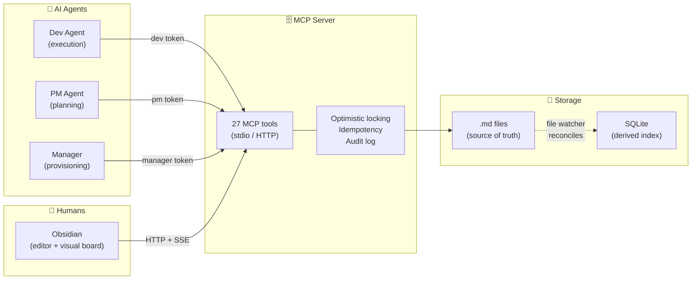
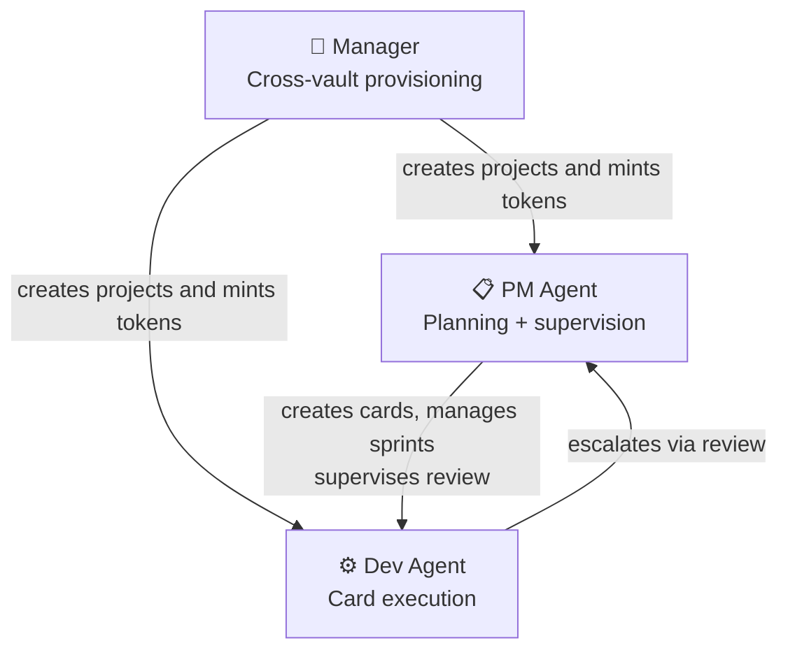
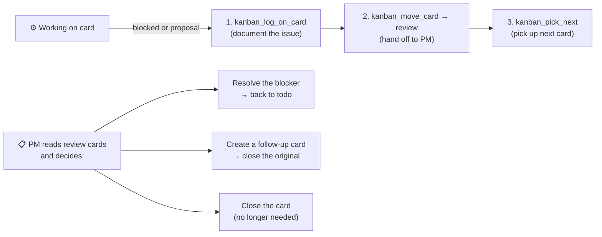
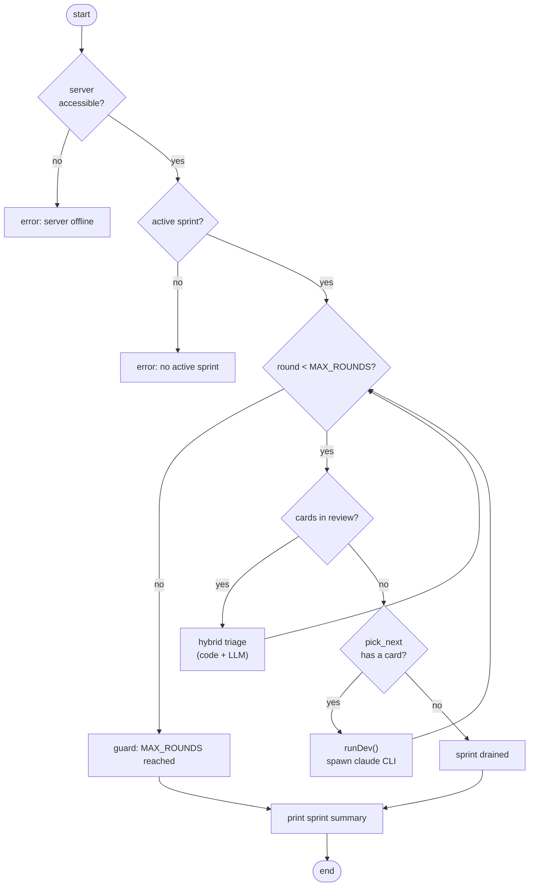
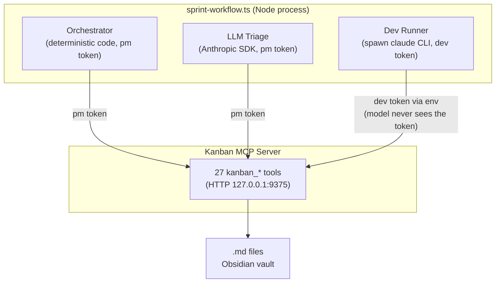
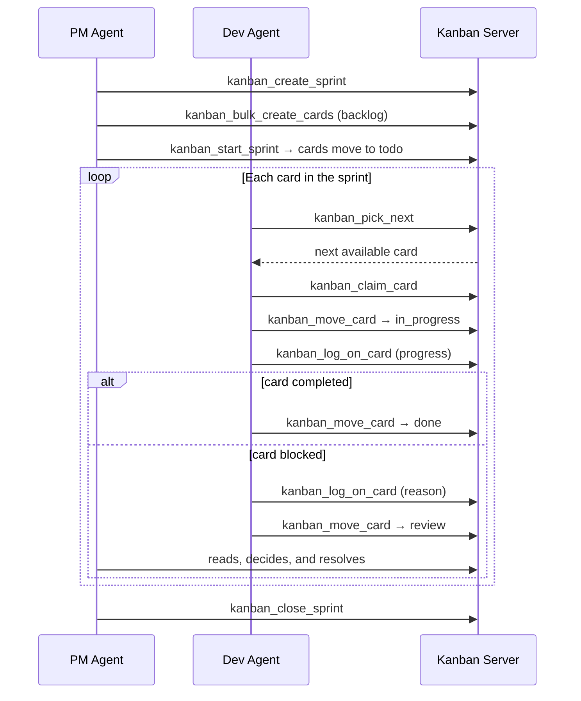

# ObsidianKan MCP

**A Kanban board for AI agents and humans — with the reliability of a database and the simplicity of Markdown files.**

ObsidianKan turns an Obsidian vault into a fully operational Kanban system that agents and humans use simultaneously, without conflict.

---

## The problem

AI agents are increasingly capable of managing long-running tasks — but they have no reliable place to track work shared with humans.

Most setups force a choice:

- **Use a task manager** — agents can't write to it natively, integrations break, humans lose their familiar workspace
- **Use plain files** — no structure, no concurrency control, no consistency when multiple agents write at the same time

The result: agents hallucinate task state, duplicate work, or silently overwrite each other's changes.

---

## The solution

ObsidianKan is an MCP server built on top of an Obsidian vault. Cards are `.md` files — readable and editable by anyone. A lightweight MCP server sits in front and gives agents a structured, safe, auditable interface to read and write those cards.

Humans keep using Obsidian as they always have. Agents call MCP tools. Both write paths are fully supported and reconciled automatically.



---

## Why it works

**Cards are just Markdown files.**
No proprietary formats. Humans read, edit, and annotate any card directly in Obsidian. The system embraces this instead of fighting it.

**Agents write through a disciplined interface.**
The server validates every agent write: field types, column existence, version conflicts. Agents get clear error responses — not silent failures.

**Conflicts are explicit and recoverable.**
Every card has an integer version. If two agents attempt to update the same card, one gets `409 Conflict` with the current card state and the list of conflicting fields.

**Retries are safe by design.**
Every mutating operation accepts a `request_id`. If an agent retries after a timeout, the server returns the original response without creating a duplicate.

**Nothing is ever lost.**
SQLite is a derived index. If deleted, the server rebuilds it from the `.md` files on the next startup.

**Everything is audited.**
Every mutation — agent write, human edit, field reversion — produces an entry in an append-only audit log.

---

## Agent types

The system has three access levels, controlled by token type. **Each agent only receives the tools it can call** — the list is filtered at connection time.



### Tool access by agent type

| Tool | Description | Dev | PM | Manager |
|------|-------------|:---:|:--:|:-------:|
| **Cards** |
| `kanban_list_cards` | List cards with filters; dev always scoped to the active sprint | ✅ | ✅ | ✅ |
| `kanban_get_card` | Fetch a full card including its body | ✅ | ✅ | ✅ |
| `kanban_log_on_card` | Append a log entry to a card (markdown + mermaid supported) | ✅ | ✅ | ✅ |
| `kanban_move_card` | Move a card between columns; accepts input/output tokens for cost tracking | ✅ | ✅ | ✅ |
| `kanban_claim_card` | Claim a card; 409 if already held by another agent | ✅ | ✅ | ✅ |
| `kanban_release_card` | Release a card; reverts to `todo` by default | ✅ | ✅ | ✅ |
| `kanban_create_card` | Create a card (title, type, sprint_id required) | ❌ | ✅ | ✅ |
| `kanban_bulk_create_cards` | Create up to 100 cards in one call; response splits into created/failed | ❌ | ✅ | ✅ |
| `kanban_update_card` | Update card fields with optimistic locking | ❌ | ✅ | ✅ |
| `kanban_reorder_card` | Reorder a card within its column | ❌ | ✅ | ✅ |
| `kanban_delete_card` | Permanently delete a card | ❌ | ✅ | ✅ |
| `kanban_archive_card` | Archive a card (hides from default listings) | ❌ | ✅ | ✅ |
| `kanban_unarchive_card` | Restore an archived card | ❌ | ✅ | ✅ |
| **Workflow** |
| `kanban_pick_next` | Return the next ready card (no unmet blockers) | ✅ | ✅ | ✅ |
| **Sprints** |
| `kanban_create_sprint` | Create a sprint in `planning` state | ❌ | ✅ | ✅ |
| `kanban_start_sprint` | Activate a sprint; refuses if one is already active | ❌ | ✅ | ✅ |
| `kanban_list_sprints` | List sprints filtered by status | ❌ | ✅ | ✅ |
| `kanban_get_sprint` | Fetch a sprint with full card list and token aggregates | ❌ | ✅ | ✅ |
| `kanban_add_to_sprint` | Attach cards to a sprint | ❌ | ✅ | ✅ |
| `kanban_move_between_sprints` | Move cards between sprints in the same project | ❌ | ✅ | ✅ |
| `kanban_close_sprint` | Close a sprint; optional rollover of unfinished cards | ❌ | ✅ | ✅ |
| **Projects** |
| `kanban_create_project` | Create a project folder and mint an initial PM token | ❌ | ❌ | ✅ |
| `kanban_list_projects` | List all projects | ❌ | ❌ | ✅ |
| `kanban_archive_project` | Hide a project from default listings | ❌ | ❌ | ✅ |
| `kanban_unarchive_project` | Restore an archived project | ❌ | ❌ | ✅ |
| `kanban_delete_project` | Permanently delete a project (requires confirm=\<project\>) | ❌ | ❌ | ✅ |
| **Auth** |
| `kanban_create_agent_token` | Mint a new agent token (`pm` or `dev`) | ❌ | ❌ | ✅ |

---

## Dev Agent escalation protocol

Dev agents cannot create cards. When blocked or wanting to propose something, they use the escalation protocol:



---

## Sprint workflow

`scripts/sprint-workflow.ts` runs an entire sprint autonomously, driving the same `kanban_*` tools as the board but replacing the manual PM with a **workflow**: the loop, sequencing, and stopping condition are deterministic code; the LLM is only called where real judgment is needed.



### How the workflow orchestrates the three actors



Obsidian has no knowledge of the workflow — it just sees cards moving on the board via SSE, as if a human were acting.

---

## Typical sprint flow



---

## Vault structure

```
vault/
  kanban-data/
    <project>/
      <card-slug>.md      # one file per card
      _meta.json          # columns, sprints, and token hashes
  .kanban/
    db.sqlite             # derived index (always rebuildable)
    audit.ndjson          # immutable log of all mutations
    manager-tokens.json   # SHA-256 hashes of manager tokens
  _kanban-secrets/
    <project>.md          # raw token shown exactly once
```

Each card is a Markdown file with YAML frontmatter managed by the server:

```markdown
---
id: card-a1b2c3d4
project: marketing
type: feature
status: in_progress
priority: high
assigned_to: agent:claude-dev
sprint_id: sprint-x9y8z7w6
version: 5
created_at: 2026-05-10T14:00:00Z
---

Card body — freely editable by humans or agents.

# Agent Log
- **2026-05-12T09:00:00Z** — started work on the login screen.
- **2026-05-12T11:30:00Z** — blocked: missing auth endpoint. Moving to review.
```

Immutable fields (`id`, `project`, `type`, `version`, `created_at`) are automatically reverted if a human edits them in Obsidian.

---

## Consistency guarantees

| Guarantee | Mechanism |
|---|---|
| **Atomic writes** | Every mutation uses `.tmp → rename`. No partially written files |
| **Optimistic versioning** | Every mutating call requires the current `version`. Conflict returns `409` with current state |
| **Idempotency** | Every call accepts a `request_id` (UUID v4). Retrying with the same id returns the cached response |
| **Rebuildable SQLite** | The index can always be reconstructed from `.md` files. On startup, divergences are reconciled by SHA-256 |
| **Audit log** | Every mutation — MCP or human edit — recorded in `audit.ndjson` with operation, actor, version, and tokens |

---

## Tech stack

- **MCP Server:** Node.js / TypeScript
- **Transports:** stdio (local agents) + Streamable HTTP at `/mcp` (remote agents); plugin uses HTTP + `/events` SSE for live board updates
- **Storage:** `.md` files as source of truth + SQLite index (`better-sqlite3`)
- **File watching:** chokidar with 500ms debounce per file
- **Plugin:** Obsidian Desktop (TypeScript)
- **Sprint Workflow:** `scripts/sprint-workflow.ts` + Anthropic SDK for LLM triage

---

## Reference docs

| Document | Contents |
|---|---|
| `docs/overview.md` | Component overview, sprint lifecycle, and guarantees |
| `docs/tool_list.md` | Full tool list generated from source code |
| `docs/agent-runbook.md` | How to mint tokens, configure clients, operate the server |
| `docs/integration-guide.md` | Wire protocol: auth, idempotency, conflicts, SSE |
| `docs/sprint-workflow.md` | Full documentation for the autonomous sprint workflow |
| `docs/design/` | Class diagrams and design invariants |
| `docs/prd/sections/` | Full PRD: data model, business rules, workflows |
