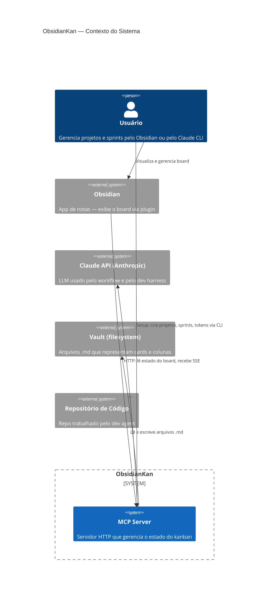
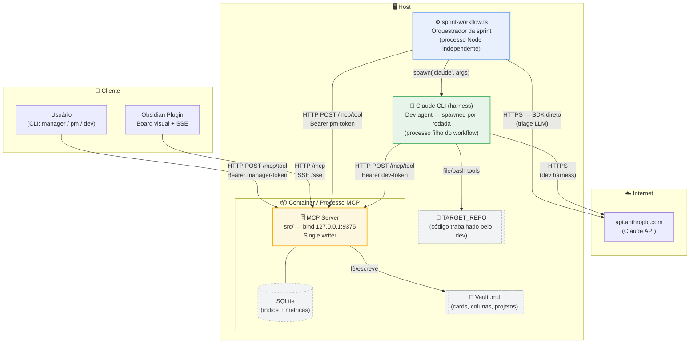
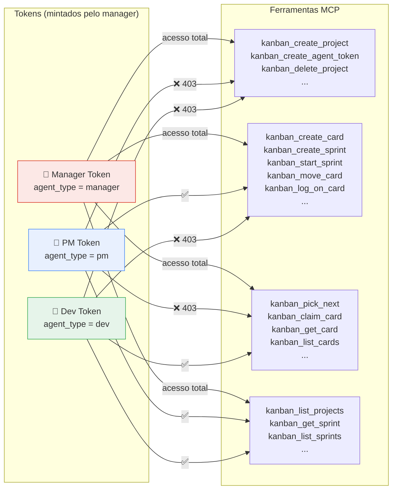
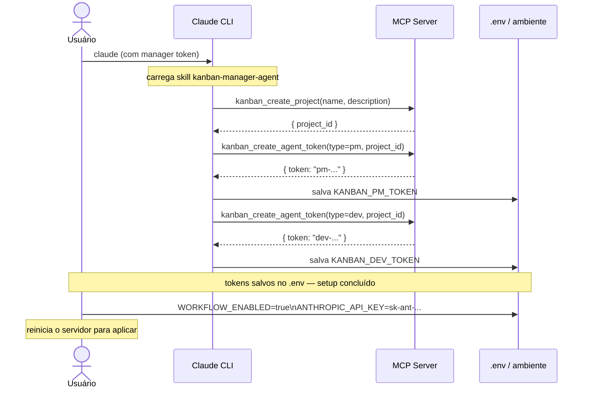
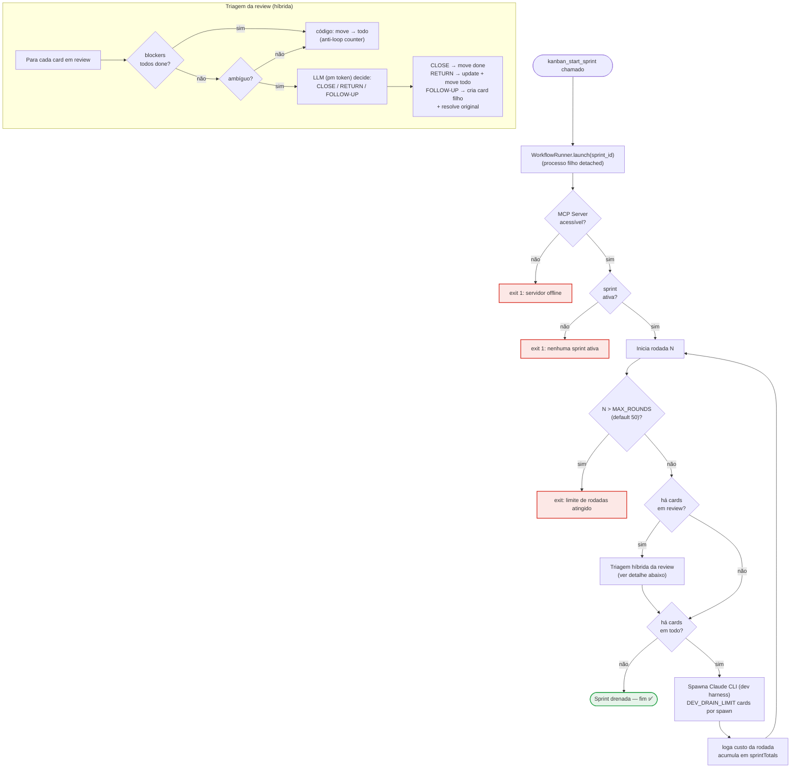

# Diagramas de Arquitetura — ObsidianKan

Série A: estrutura estática do sistema — quem existe, como se conecta, quais permissões cada ator tem.

---

## A1 — Contexto do Sistema (C4 Context)

Visão mais alta: os atores externos e o sistema como caixa-preta.

> **Nota:** o workflow e o CLI são processos separados que se comunicam com o MCP Server — detalhados em A2.

---

## A2 — Mapa de Componentes (C4 Container)

Todos os processos e artefatos, com protocolos de comunicação.

---

## A3 — Modelo de Tokens e Autorização

Três tipos de token, cada um com escopo imutável imposto server-side.

> O token é injetado **no host** (env var). O modelo nunca o vê — a autorização é transparente para o LLM.

---

## A4 — Setup Inicial de Agentes (Sequência)

O que o usuário faz uma vez antes de usar o sistema.

---

## A5 — Loop Interno do Sprint Workflow

O que acontece automaticamente após `kanban_start_sprint`.

