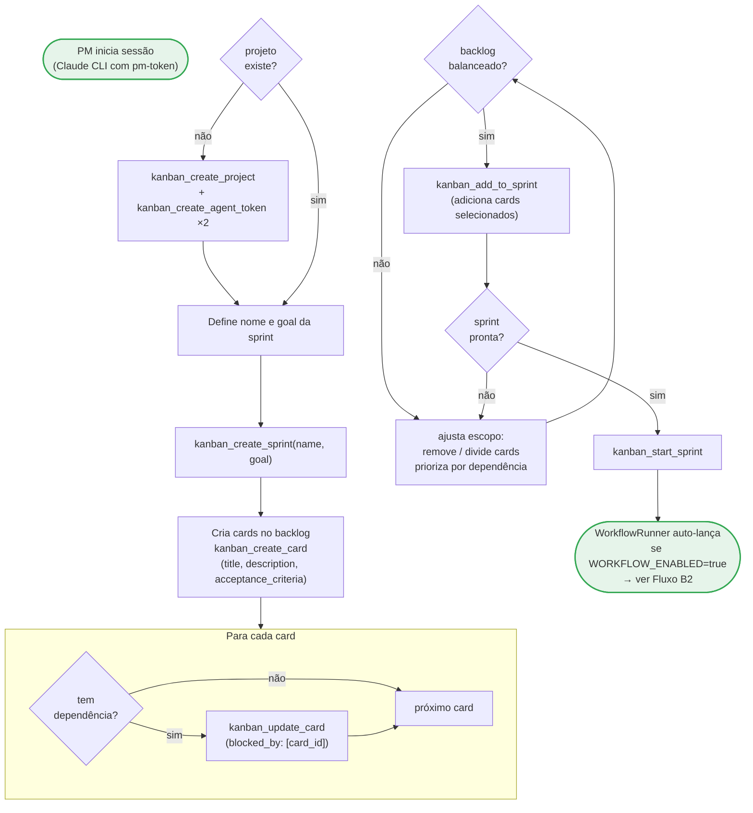
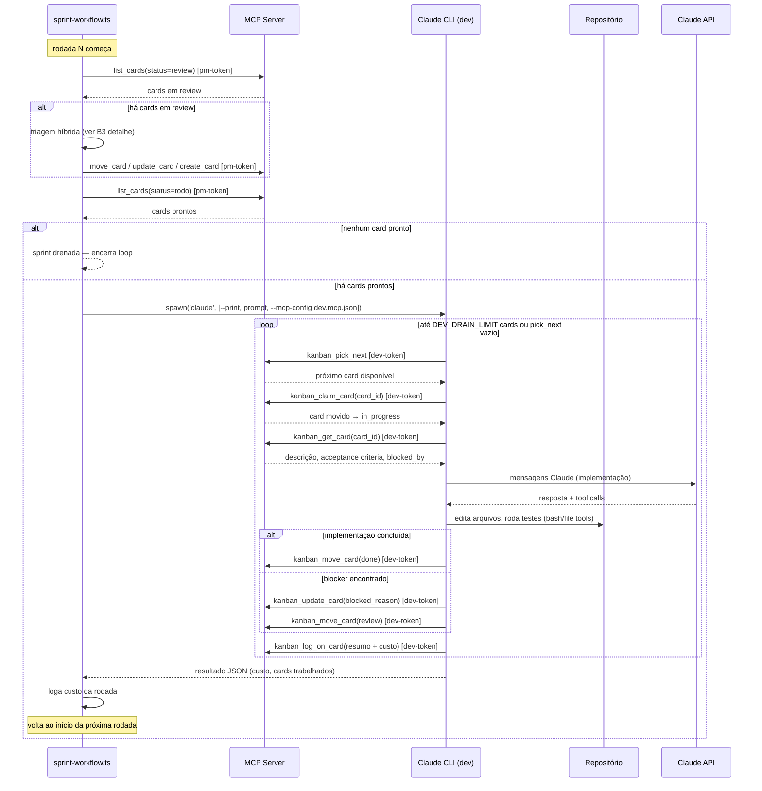
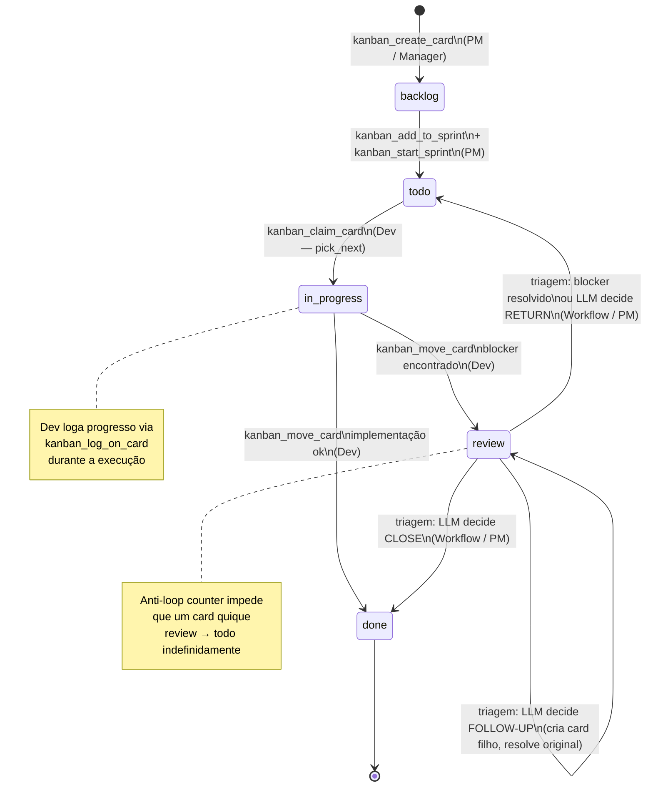
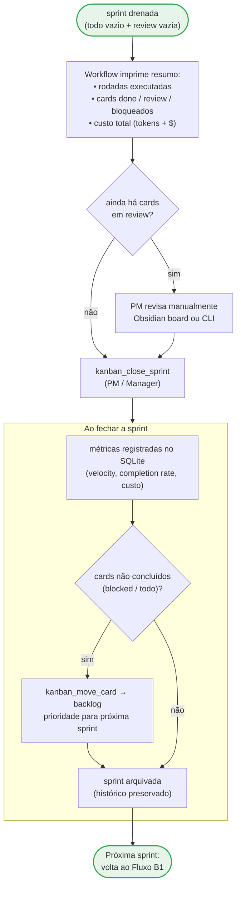

# Fluxos de Processo — ObsidianKan

Série B: como usar o sistema — os três fluxos principais do ciclo de vida de uma sprint.

---

## B1 — Criação de Sprint

Do backlog vazio à sprint pronta para iniciar.

---

## B2 — Execução da Sprint

O que acontece durante a sprint — visão do processo completo de uma rodada.

---

## B3 — Ciclo de Vida de um Card

Os estados pelos quais um card passa e quem pode executar cada transição.

---

## B4 — Encerramento de Sprint

O que acontece quando o loop drena — do último card ao fechamento.

