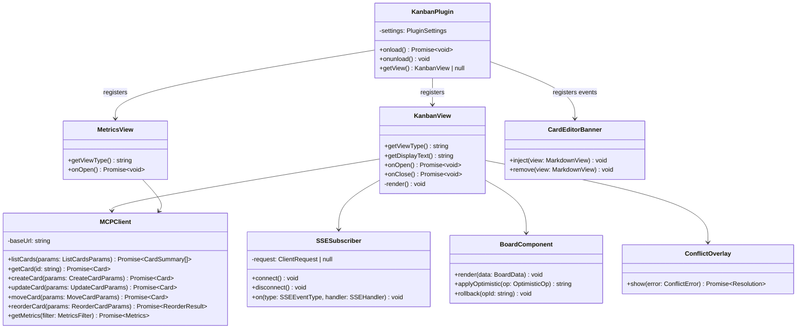

# Obsidian Plugin — Class Design

Internal class structure of the Obsidian Plugin. Normative for Sprint 03 implementation.
Cross-references: PRD §11 (UX/UI requirements), RULE-01 to RULE-10 (§11.4–§11.13).

---

## Design invariants

- **RULE-04 — No view fields on `KanbanPlugin`** — `KanbanPlugin` never stores `view: KanbanView` or any equivalent. View access is *always* on-demand through `app.workspace`, surfaced via `getView()`.
- **RULE-02 — Lifecycle-bound event registration** — every listener (DOM events, vault events, intervals) goes through `registerEvent`, `registerDomEvent` or `registerInterval` so Obsidian unregisters them on unload. `SSESubscriber` itself manages its `http.request` socket and is torn down in `onClose`.
- **RULE-01 — `isDesktopOnly: true`** — `MCPClient` uses Node's `http.request` (required for streaming SSE responses); `fetch` would buffer the full response and break the live event stream. This forces desktop-only.
- **`ConflictOverlay` is ephemeral** — instantiated by `KanbanView` on demand when a `409 Conflict` is returned, awaited for a `Resolution`, and discarded. No class holds it as a field.
- **No circular dependencies** — `KanbanPlugin → views → {MCPClient, SSESubscriber, BoardComponent}`; views depend on infrastructure, not the other way around.

---

## Class diagram

> The "registers" arrows from `KanbanPlugin` are lifecycle registrations (`registerView`, `registerEvent`), **not** field references — this is the operational form of RULE-04.

---

## Class responsibilities

### KanbanPlugin
Plugin entry point. `onload` registers the two view types, wires `CardEditorBanner` to `workspace.on('file-open', ...)` via `registerEvent`, and loads settings. `onunload` is intentionally minimal — Obsidian disposes registered views/events for us, so we do **not** call `detachLeavesOfType` (RULE-05). `getView()` returns the active `KanbanView` via `app.workspace.getLeavesOfType()` so no field ever points at a view (RULE-04).

### KanbanView
The Kanban board's view shell. `onOpen` instantiates an `MCPClient`, an `SSESubscriber` and a `BoardComponent`; subscribes to relevant SSE event types and routes them into `BoardComponent`; performs the initial `listCards`. `onClose` calls `SSESubscriber.disconnect()` and releases collaborators. Owns the lifecycle of every per-view object.

### MCPClient
Typed wrapper over the MCP HTTP transport. One method per MCP tool (`listCards`, `getCard`, `createCard`, `updateCard`, `moveCard`, `reorderCard`) plus `getMetrics`. Internally uses Node's `http.request` for symmetry with `SSESubscriber` and to bypass Obsidian's `fetch` quirks around streaming. Stateless beyond `baseUrl` and auth.

### SSESubscriber
Maintains a single long-lived `http.request` connection to the SSE endpoint, parses the `data:` lines into `SSEEvent` objects, and fans them out to handlers registered via `on(type, handler)`. Uses `http.request` (not `EventSource`, not `fetch`) because (a) Node's `EventSource` is unavailable in older Electron and (b) `fetch` buffers responses, breaking the stream. Cleanup happens in `disconnect`; reconnection on transport error is exponential-backoff with jitter.

### BoardComponent
Pure rendering + optimistic-update layer. `render(data)` reconciles the DOM against a `BoardData` snapshot. `applyOptimistic(op)` mutates the current snapshot, returns an `opId`, and lets the view show the change immediately; `rollback(opId)` restores the previous snapshot if the server rejects. No network calls — `BoardComponent` does not know `MCPClient` exists.

### ConflictOverlay
Modal-style component instantiated on demand by `KanbanView` when an MCP call returns `ConflictError`. `show(error)` resolves with a `Resolution` value (`'keep-mine' | 'keep-theirs' | 'manual'`) which the view uses to decide whether to retry with the server's `current_version` or surface the conflict for manual editing. Discarded after `show` resolves.

### MetricsView
Read-only view for the metrics dashboard. Uses its own `MCPClient` to call `getMetrics` and renders the response. Independent of `KanbanView`.

### CardEditorBanner
Per-card editor enhancement. Registered through `workspace.on('file-open', ...)` (via `registerEvent` — RULE-02). When the opened file is a card, it `inject`s a banner DOM node into the `MarkdownView` showing card state (status, version, lock indicator). `remove` is called when the file is no longer a card. All DOM listeners attached inside the banner use `registerDomEvent`.

---

## Rule cross-reference

| Rule | Where it shows up in this design |
|---|---|
| RULE-01 — `isDesktopOnly: true` | `MCPClient` and `SSESubscriber` depend on Node `http` module. |
| RULE-02 — `registerEvent` / `registerDomEvent` / `registerInterval` | `KanbanPlugin` wires `CardEditorBanner` via `registerEvent`; `CardEditorBanner` attaches DOM listeners via `registerDomEvent`. |
| RULE-03 — Vault API only | Out of scope for the listed classes — `AtomicWriter` lives on the server side; the plugin reads cards through MCP, not raw `fs`. |
| RULE-04 — No view fields on Plugin | `KanbanPlugin.getView()` resolves through `app.workspace`. No `view: KanbanView` field. |
| RULE-05 — `onunload` does not detach | `KanbanPlugin.onunload()` body is empty / settings-flush only. |
| RULE-06 — `instanceof` over casts | `getView()` checks `instanceof KanbanView` before returning. |
| RULE-07 — Scoped CSS | All DOM produced by `BoardComponent`, `ConflictOverlay`, `CardEditorBanner` lives under a plugin-scoped root class; no injected `<style>` elements at runtime. |
| RULE-08 — Command naming | Commands registered in `KanbanPlugin.onload` follow the `obsidian-kanban-mcp:*` convention. |
| RULE-09 — Accessibility | `BoardComponent` and `ConflictOverlay` set `aria-*` on focusable nodes. |
| RULE-10 — Settings persistence | `KanbanPlugin.settings` uses `loadData()` / `saveData()` only. |

---

## Verification

| # | Check | Result |
|---|---|---|
| V-01 | `KanbanPlugin` has no field of type `KanbanView` or `MetricsView` | ✅ Only field is `settings: PluginSettings`. |
| V-02 | `ConflictOverlay` is not a field on any class | ✅ Only appears as a transient dependency of `KanbanView`. |
| V-03 | `CardEditorBanner` registered via `registerEvent` (no raw `addEventListener` on workspace) | ✅ Documented under RULE-02. |
| V-04 | `SSESubscriber` uses `http.request`, not `EventSource` / `fetch` | ✅ Documented in class responsibilities. |
