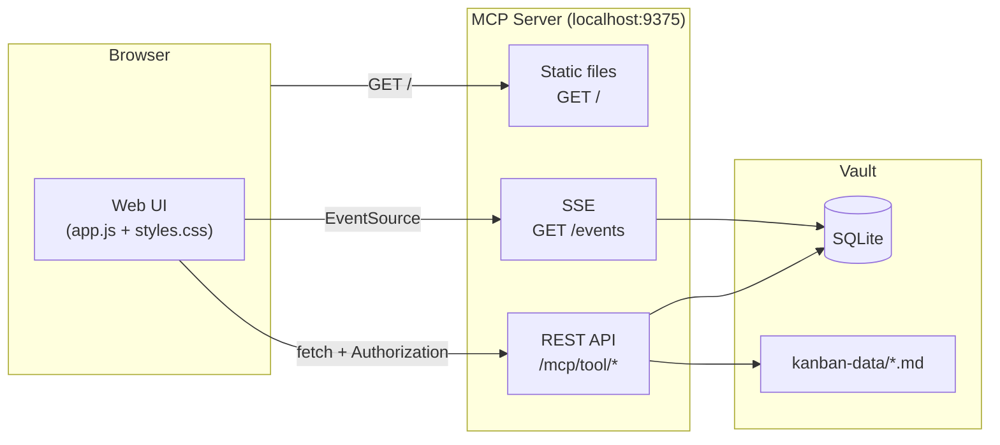

# PRD — ObsidianKan Web UI

**Versão:** 1.0  
**Data:** 2026-05-30  
**Status:** Draft

---

## 1. Visão Geral

### 1.1 O que é

ObsidianKan Web UI é um cliente web para o servidor MCP já existente. Oferece acesso ao board Kanban a partir de qualquer browser, sem necessidade do Obsidian Desktop instalado. Todos os dados, regras de negócio, concorrência e auditoria continuam sendo responsabilidade do MCP server — o web client é exclusivamente uma camada de apresentação e interação.

### 1.2 Motivação

O plugin Obsidian funciona apenas no Obsidian Desktop. Em contextos onde o usuário está em outro dispositivo, quer compartilhar acesso ao board com um colaborador, ou prefere uma interface no browser, o plugin não é uma opção. A web UI resolve isso sem duplicar lógica de negócio.

### 1.3 Princípio central

> O MCP server é a única fonte de verdade. A web UI não lê arquivos `.md` diretamente, não acessa SQLite, e não tem lógica de negócio própria. Toda mutação passa pelo MCP via HTTP.

---

## 2. Objetivos e Não-Objetivos

### Objetivos

- Espelhar funcionalmente todas as features do plugin Obsidian no browser
- Ser servida pelo próprio servidor MCP como arquivos estáticos — sem infra adicional
- Compartilhar código de renderização com o plugin (zero duplicação de lógica de board)
- Atualizações em tempo real via SSE (mesma arquitetura do plugin)
- Autenticação via token (manager token, configurado no primeiro acesso)

### Não-Objetivos

- Hosting remoto/cloud — o servidor continua rodando localmente
- Editor de markdown nativo no browser (o usuário pode abrir os `.md` no Obsidian ou qualquer editor)
- Mobile-first (foco em desktop browser; responsividade básica é suficiente)
- Autenticação multi-usuário ou sistema de login
- Substituir o plugin Obsidian — ambos coexistem

---

## 3. Usuários e Permissões

### 3.1 Perfis

| Perfil | Acesso | Token |
|--------|--------|-------|
| Manager (humano) | Todas as operações do board: criar, mover, arquivar, deletar cards, gerenciar projetos e sprints | Manager token (vault-level) |
| Agente (AI) | Apenas via MCP direto — não usa a web UI | Agent token (project-level) |

A web UI opera sempre com um **manager token**, configurado pelo usuário na tela de setup. O token é salvo em `localStorage` e enviado como `Authorization: Bearer <token>` em todas as requisições.

### 3.2 Autenticação

- Primeiro acesso: tela de setup solicita a URL do servidor e o manager token
- Token persistido em `localStorage` — sem sessão server-side
- Se o servidor retornar 401, redireciona para a tela de setup

---

## 4. Arquitetura

### 4.1 Componentes

```
MCP Server (já existente)
├── /mcp/tool/*          ← API REST (já existe)
├── /events              ← SSE stream (já existe)
├── /health              ← health check (já existe)
├── /metrics             ← métricas de tokens (já existe)
└── /  (NOVO)            ← serve os arquivos estáticos da web UI
    ├── index.html
    ├── app.js           ← bundle da web UI
    └── styles.css       ← estilos compartilhados com o plugin
```

### 4.2 Código compartilhado

| Módulo | Situação |
|--------|----------|
| `plugin/src/view/render.ts` | Compartilhado diretamente — DOM puro, sem dependência Obsidian |
| `src/types.ts` | Compartilhado diretamente |
| `plugin/styles.css` | Base do CSS web — importado com mínimas sobrescritas |
| `plugin/src/mcp/client.ts` | Portado para web com `fetch` nativo no lugar de `node:http` |

### 4.3 Build

- Toolchain: **esbuild** (mesmo do plugin)
- Entry point: `web/src/main.ts`
- Output: `web/dist/` → copiado para `server/public/` no build
- Sem framework UI — DOM vanilla, mesmo padrão do plugin

### 4.4 Diagrama de componentes



---

## 5. Features

Todas as features abaixo espelham o plugin Obsidian. A diferença principal está na feature **5.7 Card Detail** — no plugin o card é aberto como arquivo `.md` no editor Obsidian; no browser é exibido em um modal.

### 5.1 Board principal

- Todos os projetos renderizados em seções empilhadas verticalmente
- Colunas configuradas por projeto (`_meta.json`), ordenadas conforme definição
- Cards ordenados por `position` dentro de cada coluna
- Projetos arquivados exibidos com badge e estilo atenuado
- Topbar fixa com brand, botão "+ New project" e "? Help"
- Barra de progresso por projeto (done / review / in-progress)
- Contagem de cards por projeto com tooltip de detalhes por coluna

### 5.2 Sprint tabs

- Pills de navegação por sprint no header de cada projeto
- "All" exibe todos os cards independente de sprint
- Sprint selecionada filtra os cards exibidos no board
- Sprint pill nos cards visível apenas na view "All"

### 5.3 Drag & drop

- Cards arrastáveis entre colunas do mesmo projeto
- Drop zone visual com estilo de área de destino
- Cards arquivados não são arrastáveis
- Optimistic UI: card movido imediatamente, revertido em caso de erro
- Blocker warning: se o card tem bloqueadores pendentes, exibe modal de aviso antes de mover
- Sprint lock: cards de sprint não-ativa não podem ser movidos para frente

### 5.4 Card

- Exibe: título, prioridade (badge colorido), due date (vermelho se vencida), assignee, sprint pill, blocker badge com tooltip
- Botão `…` visível no hover → context menu com:
  - Archive / Restore
  - Change sprint
  - Delete

### 5.5 Card detail (diferença do plugin)

Clicar no título do card abre um **modal de detalhe** com:
- Metadados: título, status, prioridade, due date, assignee, sprint, tipo, tags, bloqueadores
- Body renderizado como markdown (incluindo mermaid, código, tabelas)
- Seção `# Agent Log` renderizada separadamente com destaque visual por entrada
- Botão "Edit in Obsidian" (deep link para abrir o arquivo no Obsidian Desktop, se disponível)

### 5.6 Criar card

- Modal com campos: título, tipo (com sugestões), prioridade, sprint, blocked by, tags, due date, assigned to, body (textarea markdown)
- Sprint obrigatória — se não há sprint planning/active, submit bloqueado
- Blocked by: dropdown com cards da sprint selecionada; oculto se sem candidatos

### 5.7 Criar projeto

- Modal com campo de nome do projeto
- Exibe o token gerado para uso por agentes

### 5.8 Sprint management

- Botão "Start sprint" no banner da sprint em planning
- Botão "Close sprint" no banner da sprint ativa
  - Se há cards não-concluídos: modal de rollover para sprint destino
  - Cards em `done` são auto-arquivados ao fechar
- Criar nova sprint via menu `⋯` do projeto

### 5.9 Past sprints

- Acessível via menu `⋯` do projeto
- Modal com lista de sprints encerradas (ordenadas da mais recente)
- Accordion colapsável por sprint — lazy load de cards ao expandir
- Cards clicáveis → abre modal de detalhe do card

### 5.10 Project menu (`⋯`)

- Create sprint
- Past sprints
- Archive / Unarchive project
- Delete project (confirmação com digitação do nome)

### 5.11 Real-time (SSE)

- Conexão automática via `EventSource` ao carregar o board
- Eventos tratados: `CARD_CREATED`, `CARD_UPDATED`, `CARD_MOVED`, `CARD_ARCHIVED`, `CARD_DELETED`, `SPRINT_STARTED`, `SPRINT_CLOSED`, `CARD_HUMAN_EDITED`
- Banner de offline quando SSE desconectado
- Reconexão automática com backoff exponencial

### 5.12 Tratamento de erros

- Toast de erro em falhas de mutação
- 409 Conflict: modal com campos conflitantes e opção de forçar ou descartar
- Offline banner quando servidor inacessível
- Rollback de optimistic updates em caso de erro

---

## 6. Modelo de Dados

Idêntico ao plugin — a web UI consome os mesmos tipos de `src/types.ts`:

- `CardSummary` — listagem do board
- `Card` — detalhe completo (inclui `body`)
- `Sprint`
- `ProjectShape` — metadados de colunas e sprints por projeto

---

## 7. API Utilizada

Todos os endpoints já existem no MCP server. A web UI não requer nenhuma mudança de API.

| Operação | Endpoint |
|----------|----------|
| Listar cards | `kanban_list_cards` |
| Detalhe do card | `kanban_get_card` |
| Criar card | `kanban_create_card` |
| Mover card | `kanban_move_card` |
| Reordenar card | `kanban_reorder_card` |
| Arquivar / restaurar | `kanban_archive_card` / `kanban_unarchive_card` |
| Deletar card | `kanban_delete_card` |
| Listar projetos | `kanban_list_projects` |
| Criar projeto | `kanban_create_project` |
| Arquivar projeto | `kanban_archive_project` |
| Deletar projeto | `kanban_delete_project` |
| Listar sprints | `kanban_list_sprints` |
| Detalhe da sprint | `kanban_get_sprint` |
| Criar sprint | `kanban_create_sprint` |
| Iniciar sprint | `kanban_start_sprint` |
| Fechar sprint | `kanban_close_sprint` |
| Mover entre sprints | `kanban_move_between_sprints` |
| Adicionar à sprint | `kanban_add_to_sprint` |
| SSE | `GET /events` |
| Health | `GET /health` |

---

## 8. UX / UI

### 8.1 Layout

```
┌─────────────────────────────────────────────────────┐
│ ObsidianKan          [+ New project]  [? Help]  [⚙] │  ← topbar fixa
├─────────────────────────────────────────────────────┤
│ ▌ Projeto Alpha          [All] [Sprint 1] [Sprint 2]│  ← project header
│   12 cards  ████████░░░░░░                    [⋯]  │  ← subtitle + progress
│  ┌─────────┐ ┌──────────┐ ┌──────────┐ ┌────────┐ │
│  │ backlog │ │  todo    │ │in-progress│ │  done  │ │  ← colunas
│  │   [3]  +│ │   [4]  + │ │   [2]   +│ │  [3]  +│ │
│  │ card... │ │ card...  │ │ card...  │ │ card...│ │
│  └─────────┘ └──────────┘ └──────────┘ └────────┘ │
│                                                     │
│ ▌ Projeto Beta           [All] [Sprint A]           │
│  ...                                                │
└─────────────────────────────────────────────────────┘
```

### 8.2 Card detail modal

```
┌──────────────────────────────────────────────────┐
│ Título do Card                              [✕]  │
├──────────────────────────────────────────────────┤
│ status: in-progress  priority: high              │
│ sprint: Sprint 1     due: 2026-06-10             │
│ assigned: agent:codex-1                          │
├──────────────────────────────────────────────────┤
│ Description                                      │
│                                                  │
│  Implementar autenticação JWT com refresh token  │
│  Critérios de aceite:                            │
│  - [ ] JWT gerado no login                       │
│  - [ ] Refresh token válido por 7 dias           │
│                                                  │
├──────────────────────────────────────────────────┤
│ 🤖 Agent Log                                     │
│                                                  │
│  **2026-05-30 14:32**                            │
│  Estratégia JWT definida. Refresh token pendente │
│                                                  │
│  **2026-05-30 16:10**                            │
│  Refresh token implementado. Testando expiração. │
│                                                  │
├──────────────────────────────────────────────────┤
│              [Edit in Obsidian]  [Close]         │
└──────────────────────────────────────────────────┘
```

### 8.3 Tela de setup (primeiro acesso)

```
┌────────────────────────────────────┐
│         ObsidianKan                │
│                                    │
│  Server URL                        │
│  [ http://localhost:9375         ] │
│                                    │
│  Manager Token                     │
│  [ ************************      ] │
│                                    │
│           [ Connect ]              │
└────────────────────────────────────┘
```

### 8.4 Estilo

- Paleta e tipografia idênticas ao plugin (variáveis CSS do Obsidian substituídas por equivalentes CSS custom properties)
- Mesmos seletores de classe — `kanban-mcp-*` — aproveitando o CSS existente
- Dark/light mode via `prefers-color-scheme` ou toggle manual

---

## 9. Sprints de Desenvolvimento

### Sprint W-01 — Infraestrutura e Setup

**Objetivo:** servidor serve a web app, build funcionando, tela de setup e board vazio renderizado.

| Task | Tipo |
|------|------|
| Configurar build esbuild para `web/src/` | scaffold |
| Adicionar rota `GET /` no servidor MCP para servir arquivos estáticos | implementation |
| Implementar cliente HTTP web (`fetch` nativo) baseado em `McpClient` | implementation |
| Implementar tela de setup (URL + token, persistência em localStorage) | implementation |
| Implementar SSE client com `EventSource` e reconexão automática | implementation |
| Render inicial do board usando `render.ts` compartilhado | implementation |

**DoD:** acessar `http://localhost:9375` no browser, inserir token, ver o board vazio com projetos.

---

### Sprint W-02 — Board read-only

**Objetivo:** board completo visível com sprint tabs e progresso.

| Task | Tipo |
|------|------|
| Listar projetos e sprints no refresh | implementation |
| Filtro por sprint (sprint tabs funcionando) | implementation |
| Barra de progresso e contagem por projeto | implementation |
| Filtro de cards arquivados (ocultar sprint-closed) | implementation |
| Banner offline quando servidor inacessível | implementation |

**DoD:** board renderiza todos os projetos, cards, colunas e sprints corretamente. Sprint tabs filtram.

---

### Sprint W-03 — Interações de card

**Objetivo:** mutações de card funcionando com optimistic UI.

| Task | Tipo |
|------|------|
| Drag & drop entre colunas | implementation |
| Sprint lock no drag (sprint não-ativa bloqueia avanço) | implementation |
| Blocker warning modal | implementation |
| Card context menu `…` (archive, restore, change sprint, delete) | implementation |
| Confirm modal para delete | implementation |
| Change sprint modal | implementation |
| Optimistic UI com rollback em erro | implementation |
| 409 conflict modal | implementation |

**DoD:** todas as mutações de card funcionam; erros exibem feedback correto.

---

### Sprint W-04 — Criar card e detalhe

**Objetivo:** criação de cards e visualização de detalhes (substitui abertura do .md).

| Task | Tipo |
|------|------|
| Modal de criar card (todos os campos, incluindo body textarea) | implementation |
| Modal de detalhe do card com body e Agent Log renderizados em markdown | implementation |
| Renderer markdown leve (marked.js ou similar) para body e agent log | implementation |
| Botão "Edit in Obsidian" (deep link `obsidian://open?vault=...&file=...`) | implementation |

**DoD:** criação de card funciona; clicar no card abre modal de detalhe com body formatado.

---

### Sprint W-05 — Projetos e Sprints

**Objetivo:** gestão completa de projetos e sprints no browser.

| Task | Tipo |
|------|------|
| Modal criar projeto (exibe token gerado) | implementation |
| Project menu `⋯` (create sprint, archive, delete) | implementation |
| Delete project modal com confirmação por digitação | implementation |
| Create sprint modal | implementation |
| Start sprint (banner planning → botão Start) | implementation |
| Close sprint (banner active → botão Close, rollover flow) | implementation |
| Past sprints modal (accordion + lazy load + card clicável) | implementation |

**DoD:** ciclo completo de projeto e sprint funciona no browser.

---

### Sprint W-06 — Real-time e polimento

**Objetivo:** SSE atualizando o board em tempo real; polish final.

| Task | Tipo |
|------|------|
| Tratar todos os eventos SSE (CARD_*, SPRINT_*) | implementation |
| Reconexão automática com backoff exponencial | implementation |
| Help modal | implementation |
| Dark/light mode | implementation |
| Acessibilidade: roles ARIA, navegação por teclado, foco em modais | hardening |
| Testes de integração: browser → MCP → SSE round-trip | testing |

**DoD:** board atualiza em tempo real sem reload; acessibilidade básica; dark/light funcionando.

---

## 10. Regras e Restrições

| Regra | Descrição |
|-------|-----------|
| WEB-01 | Toda mutação passa pelo MCP via HTTP. A web UI nunca acessa SQLite ou arquivos diretamente. |
| WEB-02 | O token é salvo apenas em `localStorage`. Nunca enviado a terceiros. |
| WEB-03 | O servidor MCP serve os arquivos estáticos via rota `GET /`. Sem servidor web separado (nginx, etc.). |
| WEB-04 | O código de renderização do board (`render.ts`) é compartilhado sem fork. Se o plugin mudar, a web UI herda. |
| WEB-05 | Seletores CSS `kanban-mcp-*` são compartilhados. Sobrescritas web ficam em namespace separado `kanban-web-*`. |
| WEB-06 | Sem dependências de framework UI (React, Vue, etc.). DOM vanilla TS, igual ao plugin. |
| WEB-07 | O SSE client usa `EventSource` nativo do browser. Sem polyfills. |

---

## 11. Riscos e Trade-offs

| Risco | Mitigação |
|-------|-----------|
| CORS: browser bloqueia requisições se servidor não configurar headers | Adicionar `Access-Control-Allow-Origin: *` no servidor para rotas `/mcp/*` e `/events` |
| Token exposto em `localStorage` | Aceitável para uso local; se futuramente for hosted, revisar para httpOnly cookie |
| Markdown renderer com suporte a Mermaid | Usar `marked` + `mermaid.js`; aceitar que renderização pode diferir do Obsidian |
| `render.ts` usa `createDiv`/`createEl` (Obsidian API) | Auditar e substituir por `document.createElement` puro, mantendo a lógica intacta |
| Deep link "Edit in Obsidian" não funciona em todos os browsers/OS | Oferecer como recurso opcional; exibir o path do arquivo como fallback |

---

## 12. Definição de Pronto (DoD global)

- [ ] Todas as features do plugin Obsidian replicadas no browser
- [ ] Board atualiza em tempo real via SSE sem reload manual
- [ ] Todos os erros (409, 400, 5xx, offline) com feedback visual adequado
- [ ] Optimistic UI com rollback correto em toda mutação
- [ ] Token configurável via tela de setup; persistido em localStorage
- [ ] Build automatizado: `npm run build:web` gera assets servidos pelo MCP
- [ ] Acessibilidade: roles ARIA em board, modais com foco trapeável, navegação por teclado
- [ ] Dark e light mode funcionando
