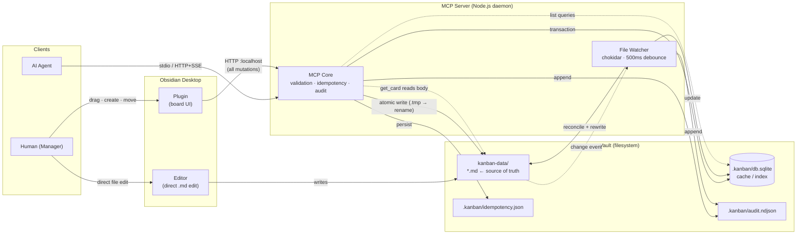
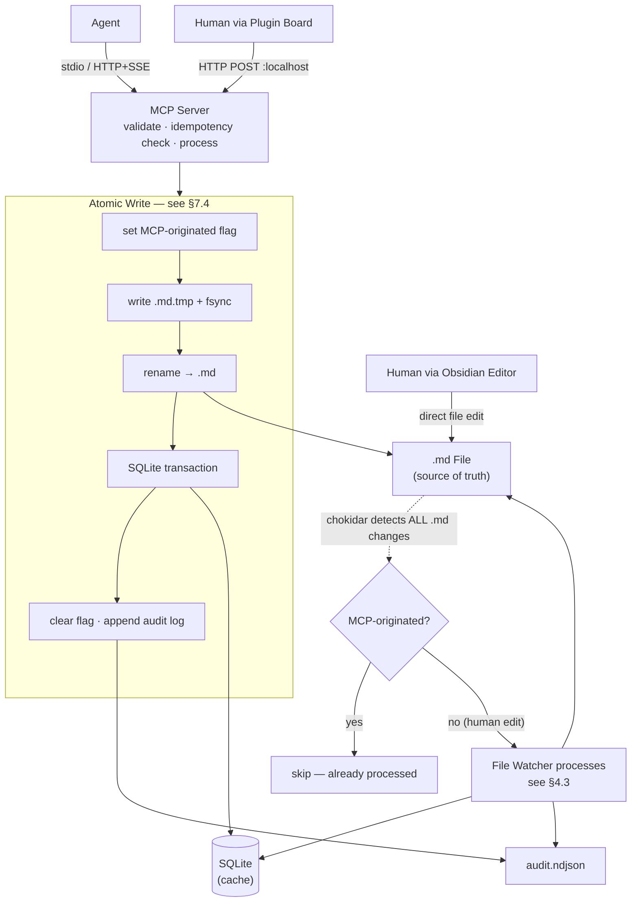
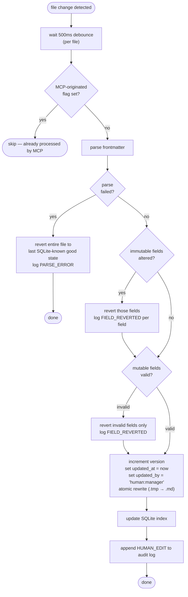
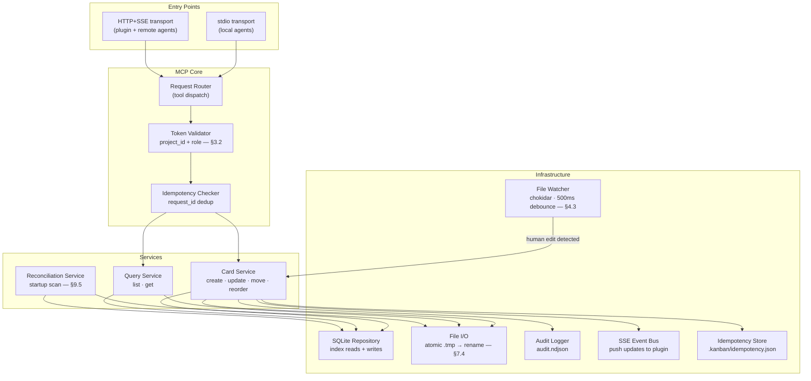

# 4. System Architecture

### 4.1  Component Responsibilities
| Component | Responsibility |
| --- | --- |
| MCP Server | Node.js daemon. Exclusive write path for agents. Owns the SQLite index. Runs the file watcher. Handles audit logging. Exposes stdio (local agents) and HTTP+SSE (remote agents and plugin Kanban board mutations). |
| SQLite Database | Persistent index stored at vault/.kanban/db.sqlite. Mirrors card frontmatter for fast queries. Source of truth remains the .md files — SQLite is a cache. Managed exclusively by MCP. |
| File Watcher | chokidar instance inside MCP. Monitors vault/kanban-data/**/*.md. On any change: parses frontmatter, validates invariants, reconciles SQLite, reverts illegal field changes, writes audit log. |
| Obsidian Plugin | TypeScript plugin inside Obsidian Desktop. Renders the Kanban board by querying MCP (list/get). Translates board interactions (drag, create) into MCP HTTP calls over localhost. Uses Node.js HTTP APIs — therefore manifest.json must declare isDesktopOnly: true. All Obsidian API interactions follow the binding implementation standards defined in §11.6. |
| Vault (Filesystem) | kanban-data/ holds the project folders and card .md files — visible in the Obsidian file explorer so the plugin can open cards in the editor. .kanban/ (hidden, dot-prefix) holds MCP internals that the user shouldn't touch. .md files in kanban-data/ are the source of truth; SQLite is derived from them and always reconcilable. |
| Audit Log | Append-only NDJSON at vault/.kanban/audit.ndjson. Written by MCP for every mutation of any origin. |

### 4.2  Write Path Diagram

### 4.3  File Watcher Reconciliation Logic
The file watcher is the central safety mechanism for human direct edits. Its processing pipeline on every file change event:

**File deletion (unlink events):** when a `.md` file is deleted by a manager, chokidar emits an `unlink` event — distinct from the `change` event pipeline above. The file watcher removes the corresponding SQLite row, emits `CARD_DELETED` to the SSE event bus (§6.10), and appends a `CARD_DELETED` entry to the audit log. No revert is attempted — manager deletion is intentional.

### 4.4  SQLite vs .md Files — Relationship
| The .md files are the source of truth. SQLite is a derived, always-reconcilable cache.  If SQLite is deleted: MCP rebuilds it from .md files on next startup. If SQLite and .md diverge (e.g. after a crash mid-write): MCP resolves by trusting the .md file. SQLite is never written to without also writing (or having just written) the corresponding .md file. SQLite does not store card body text — only frontmatter fields needed for queries and the board render. |
| --- |

### 4.5  Vault Directory Structure
| vault/   kanban-data/                    ← Visible in Obsidian explorer (no dot-prefix)     projeto-x/       _meta.json                   ← Project metadata, agent token hashes, column config       card-abc123.md       card-def456.md     projeto-y/       _meta.json       card-ghi789.md   .kanban/                         ← MCP internal data (hidden)     db.sqlite                      ← SQLite index     audit.ndjson                   ← Append-only audit log     idempotency.json               ← request_id deduplication store     manager-tokens.json            ← Vault-level manager token hashes (no project_id)   (normal Obsidian notes here...)  ← User's vault, unaffected |
| --- |

### 4.6  MCP Server Internal Module Architecture

