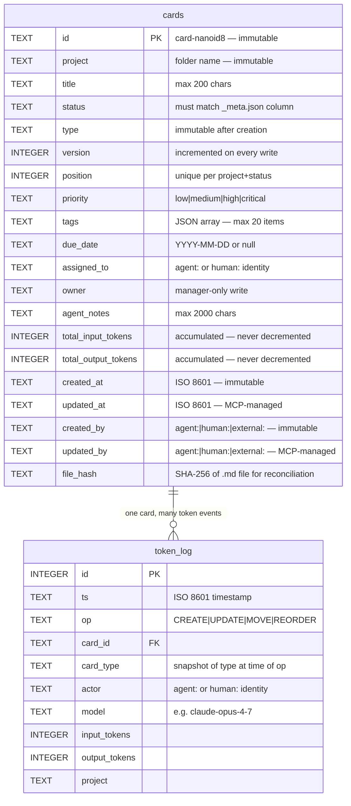

# 5. Data Model


### 5.1  Card File Format
Each card is a single .md file. The YAML frontmatter block contains all structured metadata. The body below the closing --- separator is free-form Markdown editable by humans without restrictions.
| --- id: card-abc123 project: projeto-x title: Implement authentication module type: implementation status: doing version: 7 position: 3000 priority: high tags: [backend, auth] due_date: 2025-05-10 assigned_to: agent:codex-1 owner: human:manager created_at: 2025-05-01T10:00:00Z updated_at: 2025-05-03T14:22:00Z created_by: agent:codex-1 updated_by: human:manager agent_notes: JWT strategy complete. Refresh token pending. total_input_tokens: 14820 total_output_tokens: 3210 ---  ## Description  Full Markdown body here. Humans edit this freely. No restrictions. Supports all Obsidian syntax including [[links]]. |
| --- |

### 5.2  Canonical Card Schema

#### System-Managed Fields — immutable or MCP-only
| Field | Type | Default | Rule |
| --- | --- | --- | --- |
| id | string | card-{nanoid(8)} | Immutable. Reverted by watcher if changed. |
| project | string | (folder name) | Immutable. Reverted by watcher if changed. |
| version | integer | 1 at creation | MCP-managed. Incremented on every write. Reverted if changed directly. |
| position | integer | auto-assigned | MCP-managed. See §5.4. Reverted if changed directly. |
| created_at | ISO 8601 datetime | current UTC | Immutable. Reverted by watcher if changed. |
| created_by | string | actor identity | Immutable. Reverted by watcher if changed. |
| type | string | (set at creation) | Immutable after creation. Free text — no enum. Reverted by watcher if changed. Not accepted in kanban_update_card. |
| updated_at | ISO 8601 datetime | current UTC | MCP-managed. Always set to current UTC on write. |
| updated_by | string | actor identity | MCP-managed. Set to writing actor on every write. |

#### Required Fields — human and agent writable
| Field | Type | Default | Rule |
| --- | --- | --- | --- |
| title | string | (none) | Non-empty. Max 200 chars. |
| status | string | (none) | Must match a value in project's columns array. |

#### Optional Fields — human and agent writable (unless noted)
| Field | Type | Default | Rule |
| --- | --- | --- | --- |
| priority | string | medium | Enum: low | medium | high | critical. |
| tags | string[] | [] | Max 20 items. Max 50 chars per tag. |
| due_date | string | null | null | ISO 8601 date YYYY-MM-DD. |
| owner | string | null | created_by | Manager-only write. Agent attempts → reverted / 400. |
| assigned_to | string | null | null | Agent-writable. Self-assignment supported. |
| agent_notes | string | null | null | Max 2000 chars. Replace semantics. |
| body | string | null | null | Free Markdown body. No restrictions. Not stored in SQLite. |

#### Token Tracking Fields — MCP-managed, accumulated per card
| Field | Type | Default | Rule |
| --- | --- | --- | --- |
| total_input_tokens | integer | 0 | Accumulated across all MCP mutating operations on this card. Never decremented. |
| total_output_tokens | integer | 0 | Accumulated across all MCP mutating operations on this card. Never decremented. |

### 5.3  SQLite Schema
SQLite stores all frontmatter fields needed for queries and board rendering. Card body text is not stored — it is read from .md files only when kanban_get_card is called.
| CREATE TABLE cards (   id                   TEXT PRIMARY KEY,   project              TEXT NOT NULL,   title                TEXT NOT NULL,   status               TEXT NOT NULL,   type                 TEXT NOT NULL,   version              INTEGER NOT NULL,   position             INTEGER NOT NULL,   priority             TEXT NOT NULL DEFAULT 'medium',   tags                 TEXT NOT NULL DEFAULT '[]',   -- JSON array   due_date             TEXT,   assigned_to          TEXT,   owner                TEXT,   agent_notes          TEXT,   total_input_tokens   INTEGER NOT NULL DEFAULT 0,   total_output_tokens  INTEGER NOT NULL DEFAULT 0,   created_at           TEXT NOT NULL,   updated_at           TEXT NOT NULL,   created_by           TEXT NOT NULL,   updated_by           TEXT NOT NULL,   file_hash            TEXT NOT NULL               -- SHA-256 of .md file contents );  CREATE INDEX idx_project_status   ON cards(project, status); CREATE INDEX idx_project_position ON cards(project, status, position); CREATE INDEX idx_project_type     ON cards(project, type); CREATE INDEX idx_due_date         ON cards(due_date); CREATE INDEX idx_assigned_to      ON cards(assigned_to); |
| --- |
file_hash stores the SHA-256 of the full .md file at the time of last index update. Used during startup reconciliation to detect files changed while MCP was offline.

#### token_log — per-operation token events
```sql
CREATE TABLE token_log (
  id              INTEGER PRIMARY KEY AUTOINCREMENT,
  ts              TEXT NOT NULL,        -- ISO 8601 timestamp da operação
  op              TEXT NOT NULL,        -- CREATE | UPDATE | MOVE | REORDER
  card_id         TEXT NOT NULL,
  card_type       TEXT NOT NULL,        -- snapshot do type no momento da op
  actor           TEXT NOT NULL,
  model           TEXT NOT NULL,
  input_tokens    INTEGER NOT NULL,
  output_tokens   INTEGER NOT NULL,
  project         TEXT NOT NULL
);

CREATE INDEX idx_token_log_ts       ON token_log(ts);
CREATE INDEX idx_token_log_type     ON token_log(card_type);
CREATE INDEX idx_token_log_model    ON token_log(model);
CREATE INDEX idx_token_log_project  ON token_log(project);
```
Cada operação mutante bem-sucedida escreve uma linha. Retries idempotentes (mesmo `request_id`) não escrevem. A tabela nunca é alterada — apenas appended e consultada.

#### Entity Relationship



### 5.4  Card Ordering
- position is a non-negative integer. Unique per (project, status) pair.
- On creation: position = MAX(position WHERE project=X AND status=Y) + 1000. Gap-based assignment reduces normalization frequency.
- On status change: position = MAX(position in destination column) + 1000. Card appended to bottom. This rule applies regardless of which tool triggered the status change — kanban_move_card or kanban_update_card with a status field.
- On explicit reorder: MCP normalizes all positions in the column to multiples of 1000 post-operation.
- Tie-break (position collision): secondary sort on updated_at ascending. Normalized on next write to that column.

### 5.5  Per-Field Update Semantics
All fields use Replace semantics. Writers that intend to append must read current value, construct new value, and submit the full replacement. No auto-append behavior exists.
| Field | Semantic | Detail |
| --- | --- | --- |
| title | Replace | Cannot be set to empty. |
| status | Replace | Must be valid column value. |
| priority | Replace | Must be valid enum value. |
| tags | Replace | Entire array replaced. |
| due_date | Replace | null clears the field. |
| owner | Replace (manager only) | Agent attempts rejected with 400 (MCP) or reverted (direct edit). |
| assigned_to | Replace | null unassigns. |
| agent_notes | Replace | Max 2000 chars. |
| body | Replace | Full Markdown body replaced. |
| position | Via reorder tool only | Not accepted in kanban_update_card. |
| type | Immutable | Set at creation. Not accepted in kanban_update_card. Watcher reverts direct changes. |

### 5.6  JSON Schema (Normative)
| {   "$schema": "http://json-schema.org/draft-07/schema#",   "title": "KanbanCard",  "type": "object",   "required": ["id","project","title","status","type","version","position",                "total_input_tokens","total_output_tokens",                "created_at","updated_at","created_by","updated_by"],   "additionalProperties": true,   "properties": {     "id":                   { "type":"string", "pattern":"^card-[a-zA-Z0-9]{8}$" },     "project":              { "type":"string", "minLength":1 },     "title":                { "type":"string", "minLength":1, "maxLength":200 },     "status":               { "type":"string", "minLength":1 },     "type":                 { "type":"string", "minLength":1 },     "version":              { "type":"integer", "minimum":1 },     "position":             { "type":"integer", "minimum":0 },     "total_input_tokens":   { "type":"integer", "minimum":0 },     "total_output_tokens":  { "type":"integer", "minimum":0 },     "created_at":           { "type":"string", "format":"date-time" },     "updated_at":           { "type":"string", "format":"date-time" },     "created_by":           { "type":"string", "pattern":"^(agent:|human:|external:).+$" },     "updated_by":           { "type":"string", "pattern":"^(agent:|human:|external:).+$" },     "priority":             { "type":"string", "enum":["low","medium","high","critical"] },     "tags":                 { "type":"array", "maxItems":20,                               "items":{"type":"string","maxLength":50} },     "due_date":             { "type":["string","null"],                               "pattern":"^[0-9]{4}-[0-9]{2}-[0-9]{2}$" },     "owner":                { "type":["string","null"] },     "assigned_to":          { "type":["string","null"] },     "agent_notes":          { "type":["string","null"], "maxLength":2000 }   } } |
| --- |
additionalProperties: true — managers may add custom fields. MCP and the file watcher preserve unknown fields on all writes.

