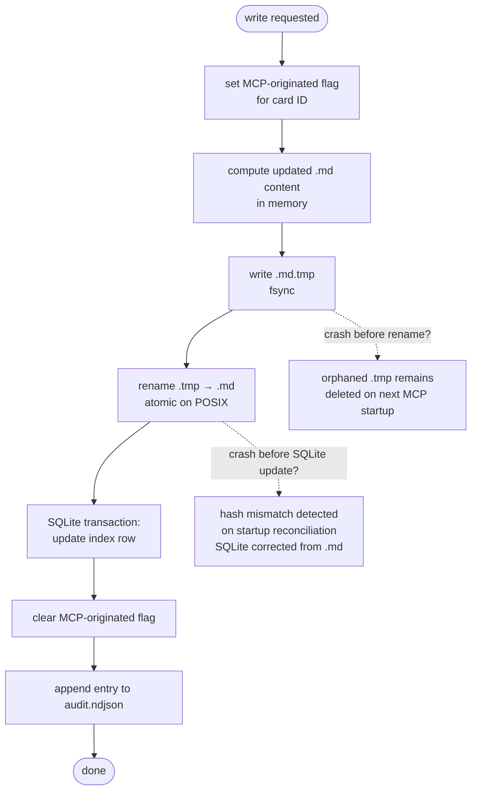

# 7. Concurrency and Versioning Strategy

### 7.1  Two Concurrency Contexts
| Context | Behavior |
| --- | --- |
| Agent writes via MCP | Explicit optimistic concurrency. Agent must supply current version. Stale version → 409. Agent retries with current_card from conflict response. |
| Human direct edits | Implicit concurrency. File watcher detects change, validates, applies version increment. No explicit version required from human. If an agent write completes between the human's read and the watcher's processing: the agent's write wins (it was first); human's edit is applied on top as a second version increment. |

### 7.2  Version Rules
- Version is a 32-bit positive integer. Minimum: 1 at creation.
- Incremented by exactly 1 on every successful write, regardless of actor.
- MCP increments version for: agent writes, plugin board actions, file watcher reconciliation of human edits.
- There are no version vectors. Single per-card integer.

### 7.3  File Watcher Debounce
Rapid successive edits to the same file (e.g. auto-save while typing) generate many watcher events. To avoid excessive version increments:
- File watcher debounces events per file: waits 500ms after the last change event before processing.
- Only the final state after the debounce window is processed — intermediate states are not versioned.
- This means a human typing for 30 seconds produces one version increment, not dozens.

### 7.4  Atomic Write Procedure (MCP and File Watcher)
- Set MCP-originated flag for the card ID (prevents watcher from double-processing).
- Compute updated content in memory.
- Write to .kanban-data/{project}/{id}.md.tmp.
- fsync the .tmp file.
- Rename .tmp → .md (atomic on POSIX).
- Update SQLite in the same logical operation (SQLite transaction).
- Clear MCP-originated flag.
- Append to audit log.
- On startup: delete any orphaned .tmp files before accepting connections.

### 7.5  Idempotency per Operation
| Operation | Class | Retry Behavior |
| --- | --- | --- |
| kanban_list_cards | Idempotent (read) | Safe to retry unconditionally. |
| kanban_get_card | Idempotent (read) | Safe to retry unconditionally. |
| kanban_create_card | Idempotent with request_id | Without: retry may create duplicate. |
| kanban_update_card | Idempotent with request_id | Without: second retry gets 409. |
| kanban_move_card | Idempotent with request_id | Same as update_card. |
| kanban_reorder_card | Idempotent with request_id | Same as update_card. |

