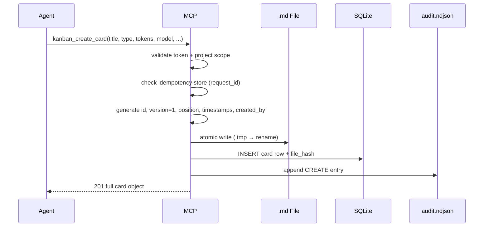
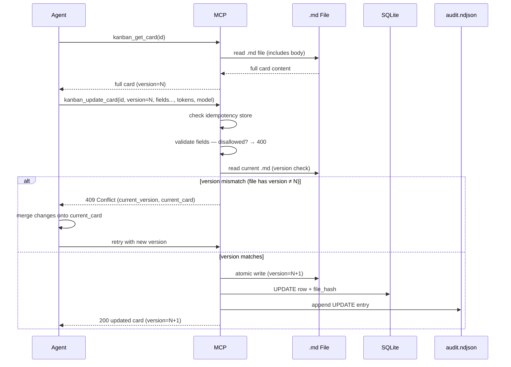
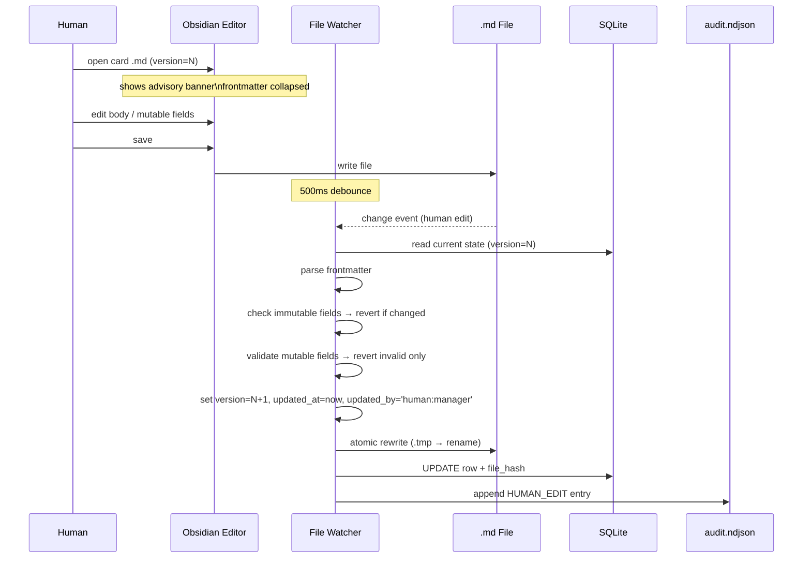
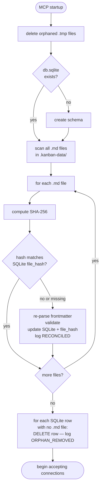
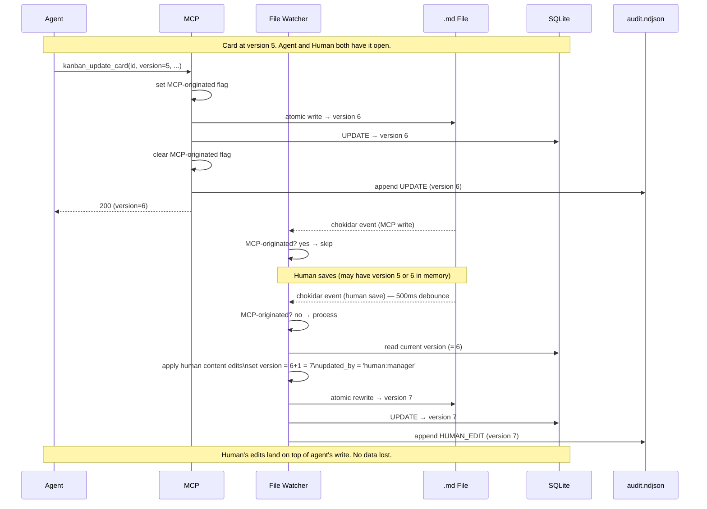

# 9. Core Workflows

### 9.1  Agent Creates a Card
- Agent calls kanban_create_card.
- MCP validates token, project scope, all field values.
- MCP checks idempotency store.
- MCP generates id, version=1, position, timestamps, created_by.
- Atomic write: .md file + SQLite transaction.
- Audit log: CREATE entry.
- Returns full card object.

### 9.2  Agent Updates a Card
- Agent reads card via kanban_get_card. Stores id and version.
- Agent calls kanban_update_card with id, version, target fields only.
- MCP checks idempotency store.
- MCP rejects disallowed fields → 400.
- MCP reads .md file. Version mismatch → 409 with current_card.
- MCP applies partial update, increments version, sets updated_at, updated_by.
- Atomic write: .md + SQLite. Audit log: UPDATE.

### 9.3  Human Edits Card Directly in Obsidian
- Human opens card .md file in Obsidian editor.
- Plugin shows frontmatter collapsed + advisory banner: 'Managed card — edit body freely. Frontmatter fields are auto-managed.'
- Human edits body text (and optionally mutable frontmatter fields). Saves.
- chokidar fires after 500ms debounce.
- File watcher parses frontmatter. Checks immutable fields against SQLite index.
- If immutable fields altered: reverts those fields. Logs FIELD_REVERTED per field.
- If invalid mutable values: reverts those fields. Logs FIELD_REVERTED.
- Increments version, sets updated_at='now', updated_by='human:manager'.
- Atomic rewrite of file + SQLite update. Audit log: HUMAN_EDIT.

### 9.4  Human Drags Card via Plugin Board
- Manager drags card from 'todo' to 'doing'.
- Plugin calls MCP HTTP: kanban_move_card { id, version (from kanban_list_cards MCP response), to_status: 'doing' }.
- MCP processes as a standard move_card: validates version, writes, logs MOVE.
- Plugin updates board from MCP response. No file watcher involvement (MCP-originated flag suppresses it).

### 9.5  Startup Reconciliation
- MCP opens SQLite. If no DB file: create schema, proceed to full scan.
- MCP scans all .md files in .kanban-data/.
- For each file: compute SHA-256. Compare to file_hash in SQLite.
- If hash matches: skip (no change since last run).
- If hash differs or entry missing: re-parse frontmatter, validate, update SQLite. Log RECONCILED.
- If SQLite has entry with no corresponding .md file: delete SQLite row. Log ORPHAN_REMOVED.
- MCP begins accepting connections.

### 9.6  Concurrent Agent Write + Human Edit
- Agent reads card at version 5. Human also has card open in Obsidian.
- Agent writes first (MCP): version 5 → 6. .md file and SQLite updated.
- Human saves file. Watcher fires after debounce.
- Watcher reads file (which has version=5 from human's in-memory state, or version=6 if Obsidian re-read the file).
- Watcher checks: version in file vs SQLite (6). Regardless of which version is in file, watcher always sets version = current SQLite version + 1 = 7.
- Human's content edits are applied on top of the agent's write. Version → 7. Audit: HUMAN_EDIT.

