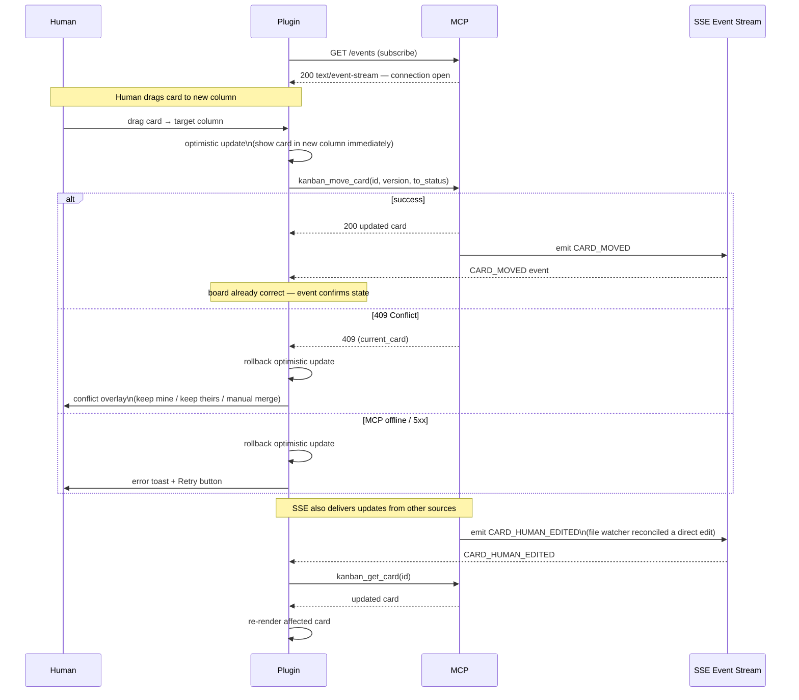

# 11. UX / UI Requirements

### 11.1  Plugin Responsibilities
- Renders the Kanban board. Queries MCP via HTTP for card data (served from SQLite).
- Translates drag-and-drop, card creation, and reorder actions into MCP HTTP calls.
- Does NOT manage the file watcher, SQLite, or any direct file writes.
- Subscribes to MCP's SSE event stream for real-time board updates.

#### Plugin ↔ MCP Communication — SSE Subscription and Optimistic UI

### 11.2  Frontmatter UX in Obsidian Editor
- When a card file is opened in Obsidian, the plugin detects it (by checking the id field pattern) and injects an advisory banner at the top of the editor view: 'Managed card — edit body and content fields freely. System fields (id, version, etc.) are auto-managed and will be corrected if changed.'
- The plugin folds (collapses) the frontmatter block by default using Obsidian's native fold API. Human sees only the body immediately.
- If the watcher reverts a field on a file the human has open, Obsidian will show a 'File changed on disk — reload?' prompt. This is acceptable behavior — the human can reload and see the corrected state.

### 11.3  Kanban Board View
- Columns ordered per project's columns array. Cards ordered by position ascending.
- Card display: title, priority badge (low=gray, medium=blue, high=orange, critical=red), due date (red+bold if overdue), first 3 tag chips, agent activity indicator (updated_by starts with 'agent:' within 5 minutes).
- Global view: all projects as stacked sections with per-column card counts.
- Optimistic UI updates: changes shown immediately, rolled back on MCP error.

### 11.4  Error Handling in UI
- 409 conflict: overlay showing diff between user's intended change and current state. Options: keep mine / keep theirs / manual merge.
- 400 disallowed fields: toast with field list.
- 500: error toast with Retry button.
- MCP offline: persistent banner. Read-only mode. 5s health polling.

### 11.5  Filtering and Search
- Filter bar: project, status, priority, tag, assigned_to, due date range, overdue toggle.
- Filters persisted in plugin settings.
- Real-time title search from SQLite (fast, no file I/O).

### 11.6  Plugin Implementation Standards
| The rules in this section are binding. They derive from the official Obsidian API documentation, the obsidian-sample-plugin template, and eslint-plugin-obsidianmd v0.2.8. Violations cause memory leaks, API rejection during community review, or broken behavior across Obsidian versions. Each rule includes the rationale. |
| --- |

#### RULE-01  manifest.json — isDesktopOnly: true (mandatory)
The plugin communicates with the MCP server via Node.js HTTP APIs (http.request over localhost). Node.js is not available in the Obsidian mobile runtime. The manifest must declare isDesktopOnly: true to prevent mobile installation and to signal to the Obsidian loader that Node.js built-ins are available.
| { "id": "obsidian-kanban-mcp",   "name": "Kanban MCP",   "version": "1.0.0",   "minAppVersion": "1.4.0",   "description": "Kanban board backed by MCP server with agent access control.",   "author": "your-name",   "isDesktopOnly": true } |
| --- |

#### RULE-02  Event Registration — registerEvent / registerDomEvent / registerInterval
All event listeners must be registered through Component lifecycle methods. Direct addEventListener() on window, document, or any persistent DOM element is prohibited — those listeners survive plugin unload, causing memory leaks and ghost handlers that fire after the plugin is disabled.
| // ❌ PROHIBITED — listener survives plugin unload document.addEventListener('click', this.handleClick); window.setInterval(this.poll, 5000);  // ✅ CORRECT — auto-cleaned up on unload this.registerDomEvent(document, 'click', this.handleClick); this.registerEvent(this.app.vault.on('modify', this.onFileChange)); this.registerInterval(window.setInterval(this.poll, 5000)); |
| --- |

#### RULE-03  File Operations — Vault API only, never raw fs in the plugin
All file interactions within the vault must use the Obsidian Vault API, not Node.js fs directly. This keeps Obsidian's internal caches and event system consistent. Note: the MCP server (a separate Node.js process outside the plugin sandbox) uses fs directly — this rule applies only to the plugin codebase.
| // ❌ PROHIBITED inside plugin fs.readFileSync(path, 'utf8');  // ✅ Background file reads const content = await this.app.vault.process(file, (data) => data);  // ✅ File deletion await this.app.fileManager.trashFile(file); |
| --- |

#### RULE-04  View References — never store in Plugin class
Storing a direct reference to KanbanView in the Plugin class creates a memory leak: Obsidian may recreate the view leaf without notifying the plugin, leaving a stale reference. Views are retrieved on demand via the workspace.
| // ❌ PROHIBITED — stale reference after leaf recreation class KanbanPlugin extends Plugin { view: KanbanView; }  // ✅ CORRECT — retrieved on demand getView(): KanbanView | null {   const leaf = this.app.workspace.getLeavesOfType(KANBAN_VIEW_TYPE)[0];   return leaf?.view instanceof KanbanView ? leaf.view : null; } |
| --- |

#### RULE-05  onunload — do not call detachLeavesOfType
Calling this.app.workspace.detachLeavesOfType() in onunload() removes the view from the workspace on every plugin reload, which is destructive behavior the user did not request. Obsidian handles leaf cleanup automatically. onunload() should only clean up resources not covered by the register* methods.

#### RULE-06  Type Safety — instanceof over type casting
Use instanceof checks instead of TypeScript type assertions (as TFile) when narrowing Obsidian API types. Type assertions bypass runtime checks and produce silent failures when the actual type differs.
| // ❌ PROHIBITED — no runtime safety const file = abstractFile as TFile;  // ✅ CORRECT if (abstractFile instanceof TFile) { /* file is safely TFile */ } |
| --- |

#### RULE-07  CSS — Obsidian variables, plugin-scoped, no injected style elements
All plugin styles must use Obsidian CSS custom properties so the board respects the user's active theme (light/dark/third-party). CSS must be scoped to the plugin's container class. Creating <link> or <style> elements programmatically is prohibited.
| /* ❌ PROHIBITED — hardcoded, unscoped, breaks themes */ background: #ffffff;  color: #333333;  /* ✅ CORRECT — scoped, theme-aware */ .kanban-mcp-board .kanban-mcp-card {   background: var(--background-secondary);   color: var(--text-normal);   border: 1px solid var(--background-modifier-border);   border-radius: var(--radius-m); } |
| --- |

#### RULE-08  Command Naming Conventions
| Rule | Requirement | Example |
| --- | --- | --- |
| Command ID | Lowercase, hyphenated. No plugin name prefix. No 'command' suffix. | open-board  ✅   obsidian-kanban-mcp-open-board-command  ❌ |
| Command name | Sentence case. No 'Command' word. No plugin name. | Open board  ✅   Open Board Command  ❌ |
| Default hotkeys | Never assign default hotkeys — leave the choice to the user. | Omit hotkeys field entirely. |
| Settings headings | Use the .setHeading() API, never manual <h2>/<h3> elements. | new Setting(containerEl).setHeading() |

#### RULE-09  Accessibility (mandatory for community release)
- All interactive elements (buttons, drag handles, card inputs) must be keyboard-accessible via Tab and Enter/Space.
- Icon-only buttons must carry an aria-label attribute that describes their action.
- Focus indicators must be visible — never use outline: none without a visible substitute.

#### RULE-10  Development Environment — dedicated test vault
Plugin development must use a dedicated test vault separate from personal notes. Running npm run dev against a production vault risks data corruption during hot-reload cycles. The test vault should contain representative sample cards for each project to validate board rendering, conflict overlays, and the MCP-offline banner.

