# MCP Server — Class Design

Internal class structure of the MCP Server. This document is normative for Sprint 01–02 implementation.
Cross-references: PRD §4.6 (modules), §6 (MCP API), §6.10 (SSE events), §7.4 (atomic write & `MCP-originated` flag).

---

## Design invariants

These hold across every arrow in the diagram below. Violating any of them is a design bug.

- **Single writer** — `CardService` is the only class that mutates `.md` files via `AtomicWriter`. `FileWatcherService` never writes; when it needs to revert an unauthorized human edit it delegates to `CardService`.
- **`MCP-originated` is owned by `AtomicWriter`** — no other class reads or sets the flag. `FileWatcherService.onFileChange` consults `AtomicWriter.isOriginated(cardId)` to decide whether to skip a self-emitted event (PRD §7.4).
- **SSE is emitted by `CardService` only** — `FileWatcherService` does not emit on the bus directly; it calls back into `CardService` (or its reconciliation entrypoint) which is responsible for the resulting event. This keeps the event stream a single causal chain.
- **`SQLiteRepository` is a derived index** — every reader and writer goes through it, but it is always rebuildable from `.md` files (`ReconciliationService.run`).
- **No circular dependencies** — the graph below is a DAG. `RequestRouter → CardService → SQLiteRepository` and `FileWatcherService → SQLiteRepository` never point back upward.

---

## Class diagram

```mermaid
classDiagram
    class MCPServer {
        +start(vaultPath: string) void
        +stop() void
    }

    class RequestRouter {
        +dispatch(tool: string, params: unknown, ctx: RequestContext) Promise~Response~
    }

    class TokenValidator {
        +validate(bearerToken: string, vaultPath: string) Promise~TokenClaims~
    }

    class IdempotencyChecker {
        +check(requestId: string) CachedResponse | null
        +store(requestId: string, response: Response) void
        +cleanup() void
    }

    class CardService {
        +create(params: CreateCardParams, ctx: TokenClaims) Promise~Card~
        +update(params: UpdateCardParams, ctx: TokenClaims) Promise~Card~
        +move(params: MoveCardParams, ctx: TokenClaims) Promise~Card~
        +reorder(params: ReorderCardParams, ctx: TokenClaims) Promise~ReorderResult~
    }

    class QueryService {
        +list(params: ListCardsParams, ctx: TokenClaims) Promise~CardSummary[]~
        +get(id: string, ctx: TokenClaims) Promise~Card~
    }

    class FileWatcherService {
        +start(dataPath: string) void
        +stop() void
        -onFileChange(filePath: string) Promise~void~
    }

    class ReconciliationService {
        +run(vaultPath: string) Promise~ReconciliationReport~
    }

    class SQLiteRepository {
        +findByProject(projectId: string, filter: CardFilter) CardSummary[]
        +findById(id: string) CardSummary | null
        +getVersion(id: string) number | null
        +insert(card: Card, fileHash: string) void
        +update(card: Card, fileHash: string) void
        +delete(id: string) void
    }

    class AtomicWriter {
        +write(filePath: string, content: string, cardId: string) Promise~void~
        +isOriginated(cardId: string) boolean
    }

    class AuditLogger {
        +log(entry: AuditEntry) void
    }

    class SSEEventBus {
        +subscribe(res: ServerResponse) void
        +unsubscribe(res: ServerResponse) void
        +emit(event: SSEEvent) void
    }

    MCPServer --> RequestRouter
    MCPServer --> FileWatcherService
    MCPServer --> ReconciliationService
    MCPServer --> SSEEventBus

    RequestRouter --> TokenValidator
    RequestRouter --> IdempotencyChecker
    RequestRouter --> CardService
    RequestRouter --> QueryService

    CardService --> AtomicWriter
    CardService --> SQLiteRepository
    CardService --> AuditLogger
    CardService --> SSEEventBus

    QueryService --> SQLiteRepository
    QueryService --> AtomicWriter

    FileWatcherService --> AtomicWriter
    FileWatcherService --> SQLiteRepository
    FileWatcherService --> AuditLogger

    ReconciliationService --> SQLiteRepository
    ReconciliationService --> AtomicWriter
```

> Each arrow `A --> B` reads as "A holds an injected reference to B at construction time and calls into it." There are no global singletons; composition happens at `MCPServer.start`.

---

## Class responsibilities

### MCPServer
Process-level lifecycle. Reads configuration, instantiates every collaborator with explicit constructor injection, wires the SSE bus to file watcher + card service, and starts the HTTP+SSE / stdio transports. Holds no business logic.

### RequestRouter
Maps an inbound MCP tool name to the right service method. Runs the request through `TokenValidator` (auth) and `IdempotencyChecker` (replay protection) before dispatching to `CardService` or `QueryService`. Catches service-thrown errors and serializes them to the MCP error envelope.

### TokenValidator
Resolves a bearer token to a `TokenClaims` discriminated union (`agent` or `manager`) scoped to a given vault. The single source of authorization truth — downstream services trust the claims it returns.

### IdempotencyChecker
Persists `request_id → response` so retries of mutating ops return the original response without re-executing. Survives server restart; periodically purges entries past the TTL window (PRD §6.11).

### CardService
**The only writer of cards.** Validates input, applies business rules (position normalization, status-change move semantics — PRD §5.4), bumps `version`, writes via `AtomicWriter`, updates `SQLiteRepository`, appends an `AuditEntry`, and finally emits the matching `SSEEvent`. Status changes through `update()` use the same position logic as `move()` so two callers can't diverge.

### QueryService
Read-only. `list` is served from `SQLiteRepository` for speed; `get` reads SQLite for metadata and `AtomicWriter` (i.e. the filesystem) for the live `body`, ensuring the response never lags a recent write.

### FileWatcherService
Listens for `change` / `unlink` events on `.md` files. For each event, skips if `AtomicWriter.isOriginated(cardId)` returns true (the write came from us). Otherwise validates the parsed frontmatter, reverts system-managed fields by delegating back through `CardService`, updates `SQLiteRepository`, and appends a `HUMAN_EDIT` / `FIELD_REVERTED` / `CARD_DELETED` audit entry. Never writes files itself.

### ReconciliationService
Startup-time pass that walks the vault, rebuilds `SQLiteRepository` rows from `.md` files when the index is missing/stale, drops orphan rows whose file no longer exists, and emits a `ReconciliationReport`. Uses `AtomicWriter` only when the report requires writing back (e.g. normalizing positions).

### SQLiteRepository
Thin data-access layer over `better-sqlite3`. Pure CRUD plus filtered project queries — no business logic, no event emission. Treated as a rebuildable cache.

### AtomicWriter
Owns the `.tmp → rename` write protocol (PRD §7.4) and the in-memory `MCP-originated` set keyed by `cardId`. Adds a `cardId` to the set immediately before the rename and removes it after chokidar's debounce window so the watcher can correctly classify the event. Exposes `isOriginated(cardId)` for the watcher; no one else should call it.

### AuditLogger
Append-only writer for the `AuditEntry` stream. One log line per mutation, regardless of origin (MCP, human, reconciliation). Failures here must not block the originating write.

### SSEEventBus
In-memory subscriber list with `subscribe / unsubscribe / emit`. `emit` is called by `CardService` only — including events that originated from human edits, which `FileWatcherService` surfaces to `CardService` rather than emitting itself.

---

## Verification

| # | Check | Result |
|---|---|---|
| V-01 | `FileWatcherService` has no edge to `AtomicWriter.write` — only `isOriginated` | ✅ Diagram shows `FileWatcherService --> AtomicWriter` for the read-side flag check only; writes go via `CardService`. |
| V-02 | `SSEEventBus` has no incoming edge from `FileWatcherService` | ✅ No such arrow exists. |
| V-03 | All §4.6 classes represented | ✅ MCPServer, RequestRouter, TokenValidator, IdempotencyChecker, CardService, QueryService, FileWatcherService, ReconciliationService, SQLiteRepository, AtomicWriter, AuditLogger, SSEEventBus — 12/12. |
| V-04 | No cycles | ✅ Topological order: `MCPServer → {RequestRouter, FileWatcherService, ReconciliationService, SSEEventBus} → {TokenValidator, IdempotencyChecker, CardService, QueryService} → {AtomicWriter, SQLiteRepository, AuditLogger}`. |
