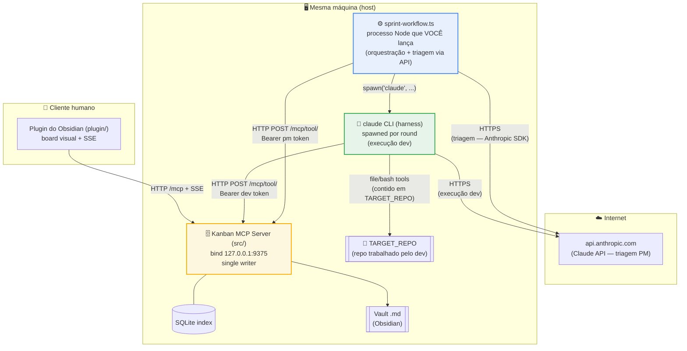
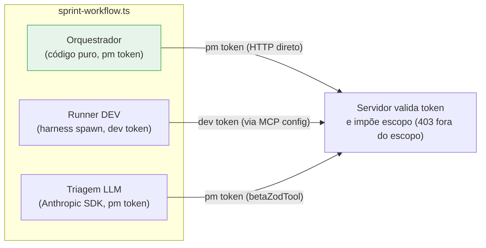
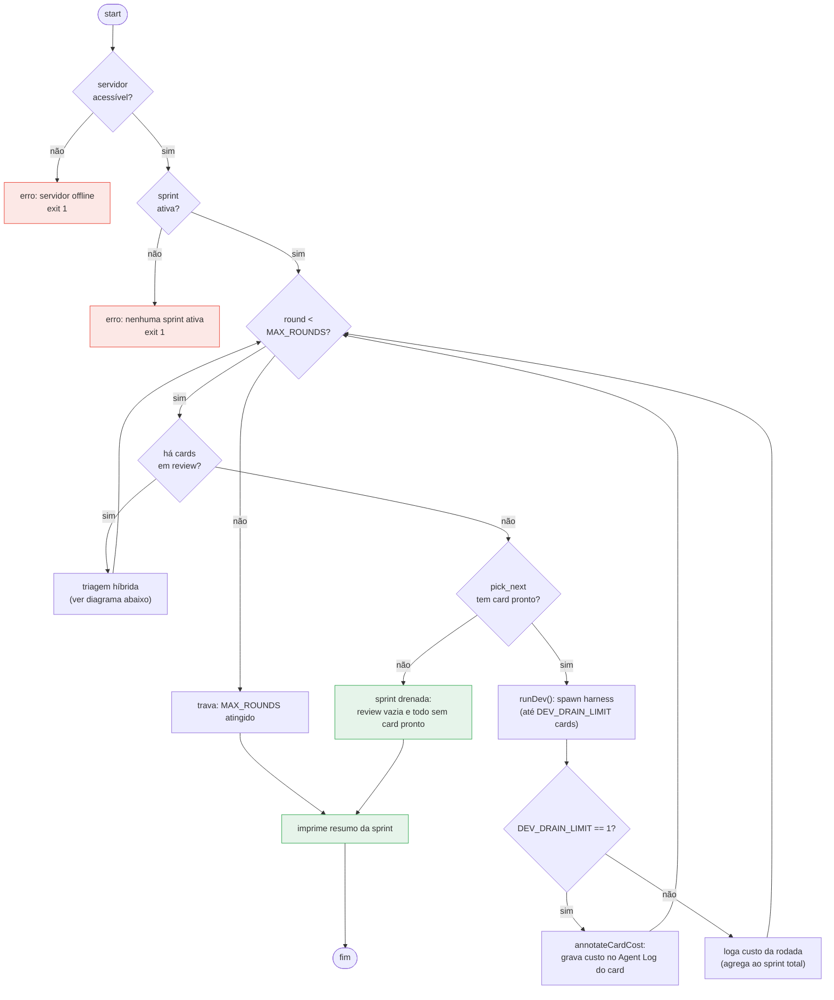
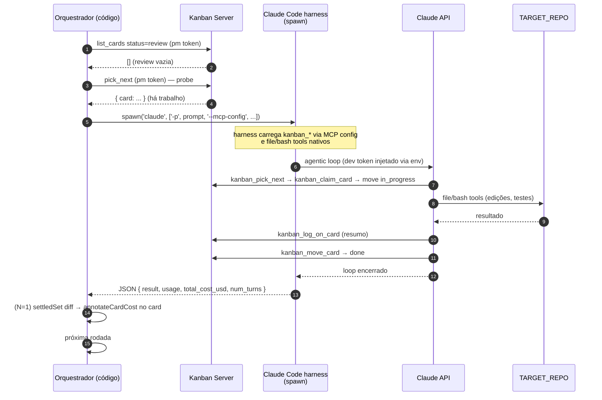
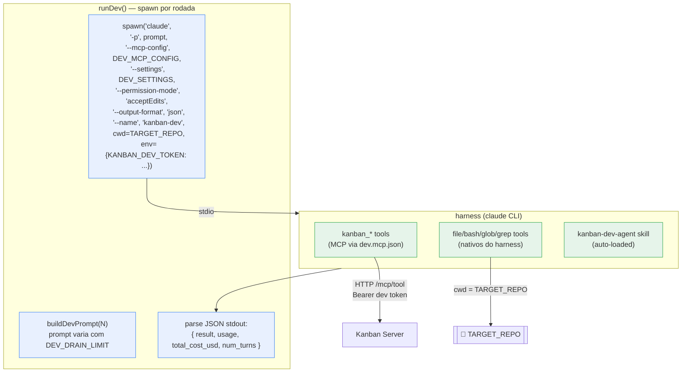
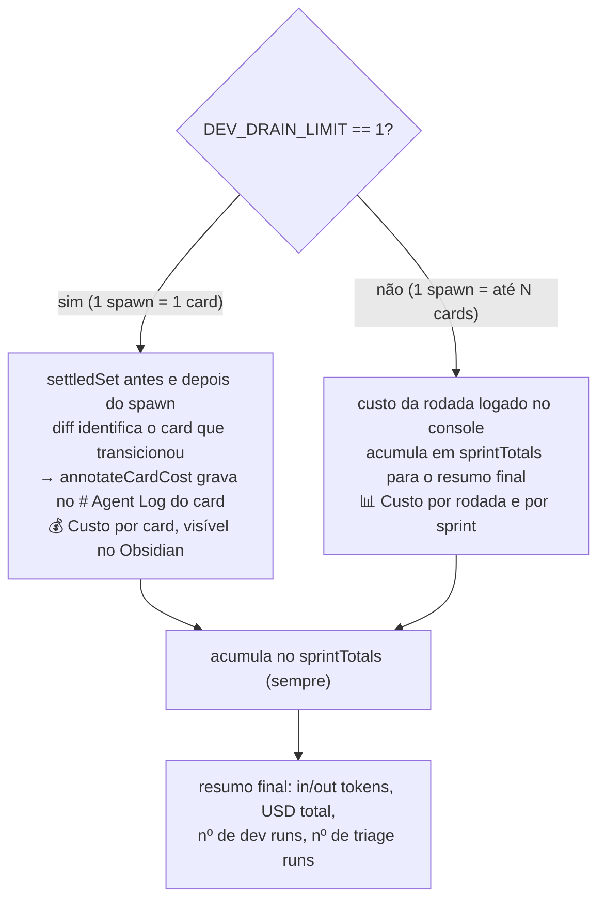
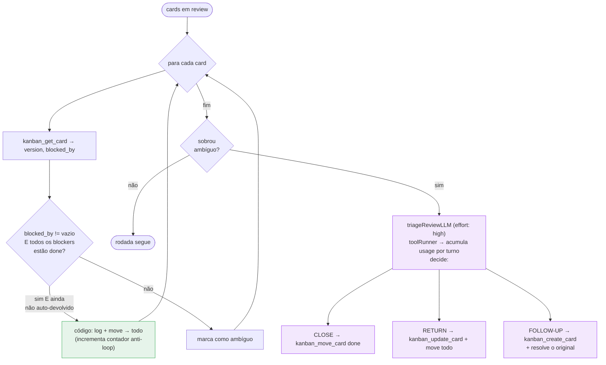
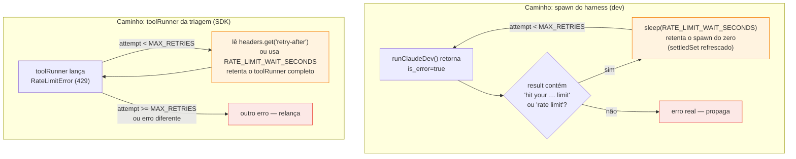
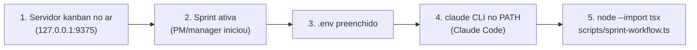

# Sprint Workflow — Execução Orquestrada por Código

`scripts/sprint-workflow.ts` executa uma sprint inteira de forma autônoma, dirigindo
os mesmos tools `kanban_*` que o board já usa, mas trocando o **PM prompted + CLI manual**
por um **workflow**: o loop, o sequenciamento e a condição de parada são código
determinístico; o LLM só é chamado onde há julgamento real.

> **Workflow vs. Agente** (no sentido do *Building Effective Agents* da Anthropic):
> um **workflow** é um caminho de código pré-definido orquestrando chamadas ao LLM;
> um **agente** deixa o LLM dirigir a própria trajetória. Na fase de sprint, as decisões
> do PM ("ainda há card pronto? → chama dev"; "review vazia? → fim") são condicionais
> sobre o estado do board — `if/else`, não julgamento. Então viram código.

---

## Onde o processo roda

O workflow **não roda no Obsidian** nem **dentro do servidor**. É um **terceiro processo
Node independente** que você lança. Ele não toca o banco diretamente — passa pelos tools
HTTP do servidor, igual a todo mundo. O servidor continua sendo o **único dono** do
SQLite + vault (single writer).



Por que **na mesma máquina que o servidor**:

| Motivo | Detalhe |
|---|---|
| Alcance do servidor | `KANBAN_URL` default é `127.0.0.1:9375`; o servidor faz bind só em **loopback** — o workflow precisa estar no mesmo host. |
| Saída para a API | Precisa de internet de saída para `api.anthropic.com`. |
| Acesso ao código | O harness do dev edita arquivos em `TARGET_REPO` no filesystem local. |

O Obsidian nem sabe que o workflow existe — só vê os cards se moverem no board via SSE,
como se um humano ou agente estivesse mexendo.

---

## Os três atores e a fronteira de identidade

Todos falam com o servidor pelo mesmo HTTP, mas com **tokens diferentes**. O servidor
**impõe o escopo por token** (um dev tentando um tool de PM recebe `403`). O workflow
injeta o Bearer correto **host-side** — o modelo nunca vê o token.



- **Orquestrador** — código puro. Lê o board (pm token via HTTP direto) para decidir.
- **Runner DEV** — `child_process.spawn('claude', ...)`. O harness carrega o dev token
  via env var; o modelo nunca o vê.
- **Triagem LLM** — Anthropic SDK com `betaZodTool`. Tools injetadas com pm token
  host-side pelo wrapper `kanbanTool`.

---

## O loop de orquestração

Código determinístico. Cada rodada: triagem da `review` primeiro, depois despacho de um
dev, até a sprint drenar. Há um `MAX_ROUNDS` (default 50) como trava de segurança.



A ordem importa: **triar `review` antes de despachar dev** garante que blockers
resolvidos voltem ao `todo` antes do `pick_next` rodar, e evita acumular trabalho
pendente de decisão.

---

## Sequência de uma rodada (caminho feliz)



---

## O runner do DEV — `child_process.spawn('claude', ...)`

O dev roda como um **processo `claude` CLI completo**, não como um toolRunner hand-rolled.
Isso é deliberado: o harness traz context management, prompt caching, retry, e as ferramentas
de arquivo/bash maduras — reimplementar tudo isso seria inferior.



**Configurações por path absoluto** — `DEV_MCP_CONFIG` e `DEV_SETTINGS` são resolvidos
a partir de `REPO_ROOT` (diretório do workflow), **não** de `TARGET_REPO`. O `cwd` do
spawn é `TARGET_REPO`, que pode ser um repo diferente; usar paths relativos quebraria
quando eles divergem.

**Prompt parametrico** (`buildDevPrompt`): o texto muda conforme `DEV_DRAIN_LIMIT`:

| N | Instrução principal |
|---|---|
| `1` | "Pick EXACTLY ONE ready card … then STOP. Do not start a second card." |
| `> 1` | "Work up to N ready cards. … STOP when ANY of these is true: completed N; pick_next empty; blocker → review." |

O skill `kanban-dev-agent` (auto-carregado pelo harness) já traz o protocolo completo
(`claim → in_progress → work → log → done/review`); o prompt só acrescenta a granularidade
e a definição de parada.

---

## Medição de custo — varia com `DEV_DRAIN_LIMIT`

O harness retorna `total_cost_usd`, `usage.input_tokens` e `usage.output_tokens` no JSON
de saída. Isso é o custo **exato** do spawn. A granularidade do que fazemos com ele depende
de `N`:



| `DEV_DRAIN_LIMIT` | Custo por card | Custo por rodada | Custo por sprint |
|---|---|---|---|
| `1` | ✅ exato, gravado no card | ✅ (= por card) | ✅ |
| `> 1` | ❌ (1 spawn > 1 card) | ✅ logado no console | ✅ |

> **Por que N=1 é exato?** Quando um spawn processa um único card, `total_cost_usd` do
> harness é o custo daquele card. O `settledSet` (snapshot antes/depois do spawn de cards
> em `done`/`review`) confirma qual card transicionou; `annotateCardCost` grava a medição
> no `# Agent Log` do card via `kanban_log_on_card` (pm token).

---

## Triagem híbrida da review

Código trata o caso **mecânico**; o LLM só vê o **ambíguo**. Um contador anti-loop evita
que um card fique quicando `review → todo → review` para sempre.



> A detecção de "trabalho concluído" (CLOSE) é deixada de propósito para o LLM — exige
> ler o log e julgar. O código só faz o que é puramente mecânico: devolver ao `todo` um
> card cujo único obstáculo era um blocker agora `done`.

A triagem LLM itera o `toolRunner` para **somar usage de todos os turnos** (a forma
`await` só expõe o último turno; `for await` acumula tudo). Custo calculado a
`$5/$25` por 1M tokens (Opus 4.8).

---

## Rate limit — créditos esgotados

A Anthropic libera créditos periodicamente. Quando acabam no meio de uma sprint, o
workflow **espera e retenta automaticamente** — não aborta. Os dois caminhos têm
sinais diferentes:



| Caminho | Sinal detectado | Fonte do tempo de espera |
|---|---|---|
| **Spawn** | `is_error=true` + regex no `result`: `"hit your … limit"`, `"rate limit"`, `"credits exhausted"` | `RATE_LIMIT_WAIT_SECONDS` (configurável) |
| **Triage SDK** | `RateLimitError` (HTTP 429) | `retry-after` do header da API; fallback para `RATE_LIMIT_WAIT_SECONDS` |

> **Por que o spawn é retomado do zero?** O harness pode ter progresso parcial quando
> aborta (card em `in_progress`, logs já escritos). Na retentativa, o harness pega o
> estado atual do board via `kanban_pick_next` e continua de onde o card ficou — o
> protocolo do `kanban-dev-agent` skill já prevê isso. O `settledSet` é refrescado a
> cada tentativa para que a atribuição de custo por card (N=1) reflita o estado real.

Saída no console durante a espera:

```
⏳ DEV: credits exhausted — waiting 5min before retry (attempt 1/10)
⏳ TRIAGE: rate limit (429) — waiting 3min before retry (attempt 1/10)
```

---

## Pré-requisitos e execução



Variáveis de ambiente (`.env`):

| Variável | Obrigatória | Default | Para quê |
|---|---|---|---|
| `ANTHROPIC_API_KEY` | sim | — | Chave da API da Anthropic (triagem LLM). |
| `KANBAN_DEV_TOKEN` | sim | — | Token dev (`agent_type=dev`), mintado pelo manager. Injetado no env do spawn — nunca passado ao modelo. |
| `KANBAN_PM_TOKEN` | sim | — | Token pm (`agent_type=pm`), mintado pelo manager. Usado pelo orquestrador e triagem. |
| `KANBAN_URL` | não | `http://127.0.0.1:9375` | Base do servidor kanban. |
| `TARGET_REPO` | não | `process.cwd()` | Diretório onde o harness do dev opera (`cwd` do spawn). |
| `DEV_DRAIN_LIMIT` | não | `3` | Cards por spawn. `1` = um card/rodada com custo exato por card; `> 1` ≈ drena até N, agrega custo por rodada. |
| `DEV_MCP_CONFIG` | não | `.claude/skills/kanban-pm-agent/dev.mcp.json` | Path absoluto ao MCP config do harness dev. Resolvido a partir do repo do workflow, não de `TARGET_REPO`. |
| `DEV_SETTINGS` | não | `.claude/skills/kanban-pm-agent/dev-settings.json` | Path absoluto ao settings do harness dev. |
| `SPRINT_MAX_ROUNDS` | não | `50` | Trava de segurança do loop. |
| `RATE_LIMIT_WAIT_SECONDS` | não | `300` | Segundos de espera quando créditos acabam. Para a triagem, o header `retry-after` da API tem precedência quando presente. |
| `RATE_LIMIT_MAX_RETRIES` | não | `10` | Máximo de retentativas por operação antes de desistir com erro. |
| `DEBUG_LOG` | não | — | Path para um arquivo de log. Quando definido, cada chamada a `log()` é gravada lá com timestamp ISO, além do stdout normal. Definido automaticamente pelo servidor quando `WORKFLOW_LOG_DIR` está configurado. |

Comando:

```bash
node --import tsx scripts/sprint-workflow.ts
```

---

## Execução automática via servidor

O servidor pode lançar o workflow automaticamente sempre que uma sprint é ativada via
`kanban_start_sprint`. O processo filho é `detached + unref'd` — o servidor não bloqueia
e pode encerrar independentemente.

Configure as variáveis abaixo no **ambiente do servidor** (`.env` ou env do processo que
sobe o `src/index.ts`):

| Variável | Obrigatória | Default | Para quê |
|---|---|---|---|
| `WORKFLOW_ENABLED` | sim (para ativar) | `false` | Defina `true` para habilitar o auto-launch. |
| `WORKFLOW_SCRIPT_PATH` | sim (quando habilitado) | — | Path absoluto para `packages/server/scripts/sprint-workflow.ts`. Sem default: se faltar, o auto-launch é desligado com um `logger.warn`. |
| `WORKFLOW_LOG_DIR` | não | — | Diretório para logs por sprint. Quando definido, o servidor cria `<dir>/sprint-<id>.log`, redireciona stdout+stderr do processo filho para ele e injeta `DEBUG_LOG=<caminho>` no env do workflow. |

O diretório de trabalho do harness dev vem do `target_repo` do projeto (definido por
`kanban_set_project_repo`), que o servidor usa como `cwd` do processo filho — não há
variável de ambiente para isso.

Os tokens (`ANTHROPIC_API_KEY`, `KANBAN_DEV_TOKEN`, `KANBAN_PM_TOKEN`) são **herdados do
env do servidor** — basta que estejam presentes lá. `KANBAN_DEV_TOKEN` e `KANBAN_PM_TOKEN`
são obrigatórios: o workflow encerra com exit 2 se algum faltar.

```bash
# Exemplo: .env do servidor com auto-launch ligado
WORKFLOW_ENABLED=true
WORKFLOW_SCRIPT_PATH=/abs/path/to/packages/server/scripts/sprint-workflow.ts
WORKFLOW_LOG_DIR=/abs/path/to/logs/sprints

ANTHROPIC_API_KEY=sk-ant-...
KANBAN_DEV_TOKEN=kbt-dev-...
KANBAN_PM_TOKEN=kbt-pm-...
```

Saída no console do servidor ao iniciar:

```
[workflow] auto-launch enabled: script=/abs/path/to/scripts/sprint-workflow.ts
...
[workflow] launched sprint=spr_abc123 pid=12345 log=/abs/path/to/logs/sprints/sprint-spr_abc123.log
```

---

## Limitações conhecidas

- **`claude` CLI no PATH obrigatório.** O runner do dev depende de `spawn('claude', ...)`.
  Se o CLI não estiver instalado ou não estiver no PATH do processo Node, o spawn falha
  imediatamente com mensagem clara.
- **Custo do dev via harness, não via SDK.** `total_cost_usd` vem do JSON de saída do
  harness; o orquestrador não tem acesso aos tokens internos do loop do dev. Para N=1,
  o custo é exato por card; para N>1, é exato por rodada (soma de todos os cards do spawn).
- **Rate limit da triagem não é idempotente em falha parcial.** Se o toolRunner fez
  algumas tool calls (moveu um card) antes de lançar `RateLimitError`, a retentativa
  verá o board nesse estado parcial. Como as mutações kanban são idempotentes por
  `request_id`, mover um card já movido é inócuo — mas o LLM pode re-avaliar cards
  que já foram triados. Aceitável para o nível de criticidade da triagem.
- **Triagem CLOSE depende do LLM.** Quando as regras de triagem estabilizarem, dá para
  promover mais casos para o caminho de código determinístico.
- **Convive, não substitui.** Os skills/CLI seguem úteis para o modo interativo/exploratório;
  o workflow é o caminho **autônomo** para drenar uma sprint inteira.
