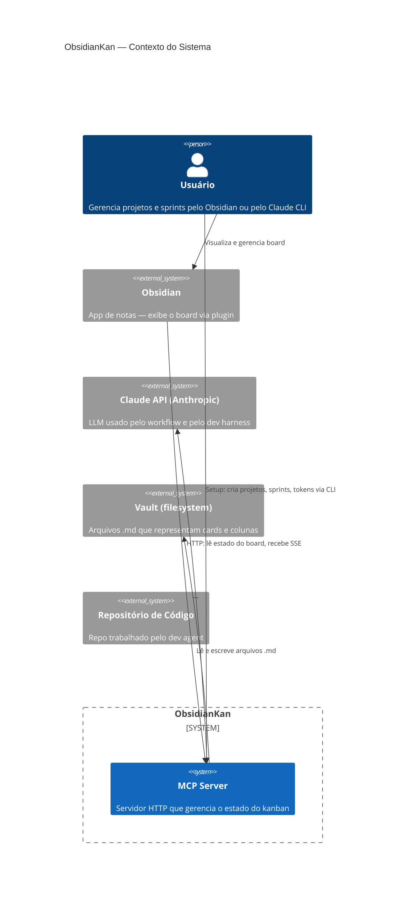
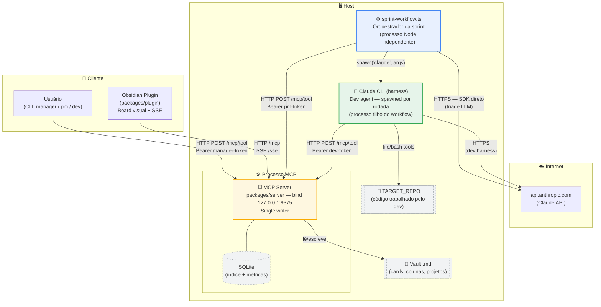
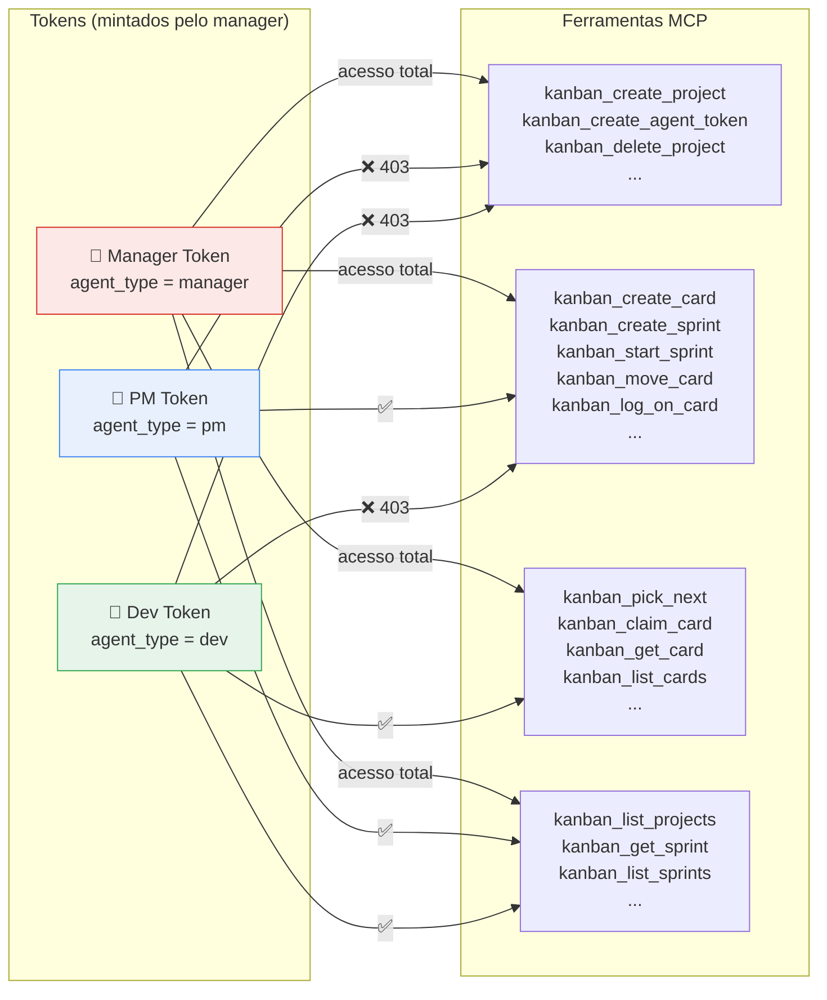
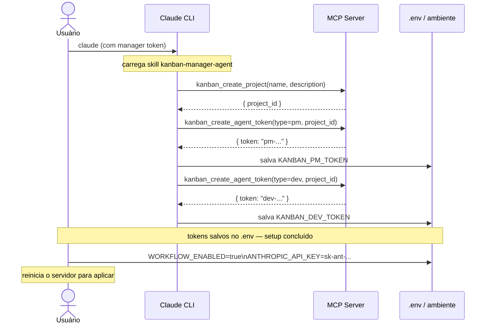
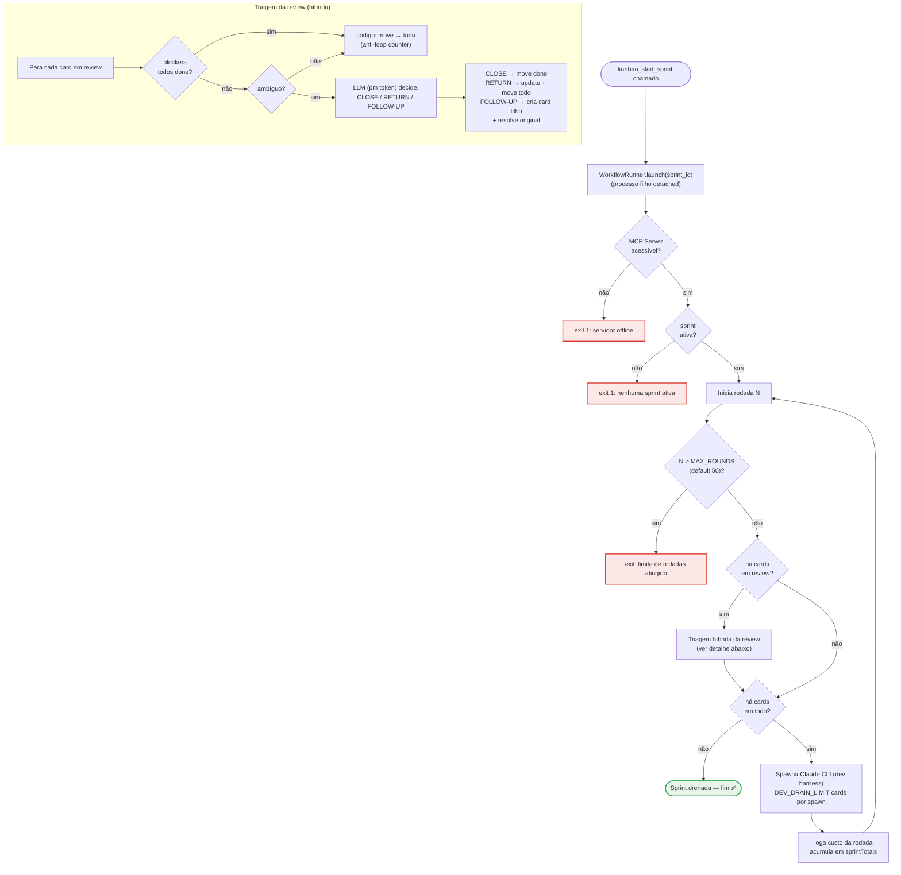
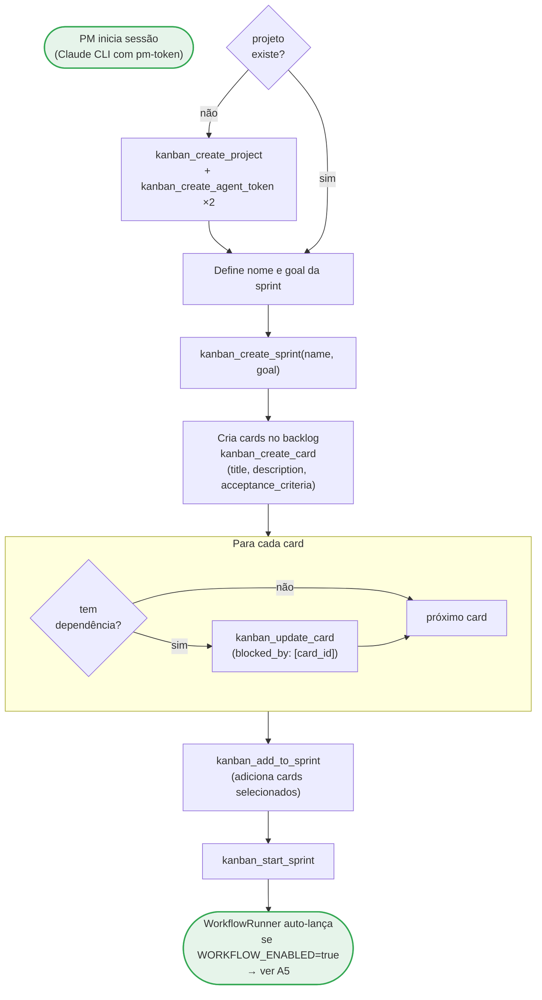
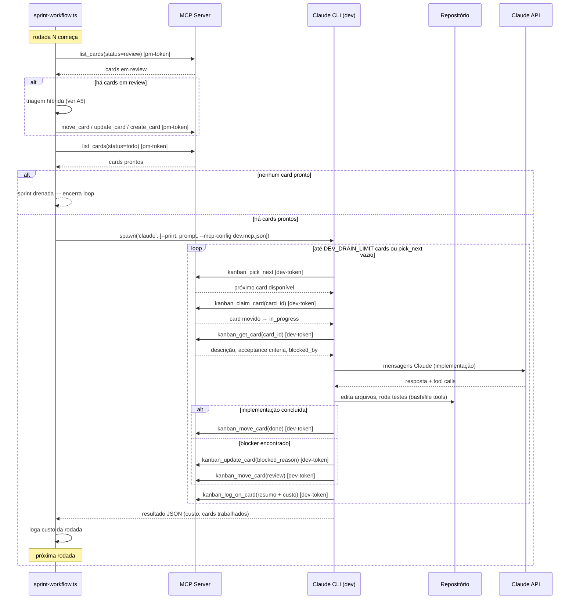
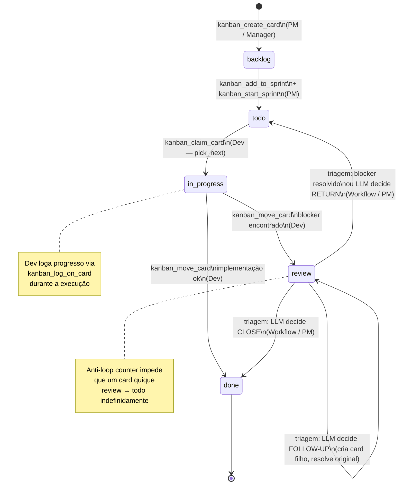
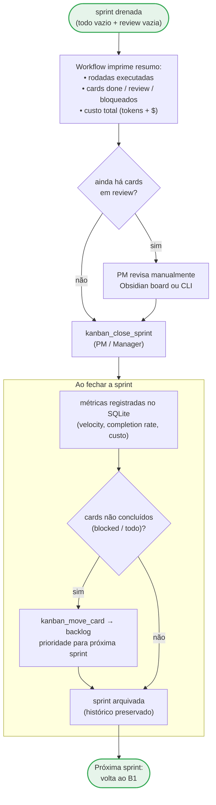

# Arquitetura — ObsidianKan

Referência técnica da arquitetura do sistema: estrutura estática, fluxos de processo e padrões de implementação.

---

## Índice

- [A1 — Contexto do Sistema](#a1--contexto-do-sistema-c4-context)
- [A2 — Mapa de Componentes](#a2--mapa-de-componentes)
- [A3 — Modelo de Tokens e Autorização (RBAC)](#a3--modelo-de-tokens-e-autorização-rbac)
- [A4 — Setup Inicial de Agentes](#a4--setup-inicial-de-agentes-sequência)
- [A5 — Loop Interno do Sprint Workflow](#a5--loop-interno-do-sprint-workflow)
- [B1 — Criação de Sprint](#b1--criação-de-sprint)
- [B2 — Execução da Sprint](#b2--execução-da-sprint)
- [B3 — Ciclo de Vida de um Card](#b3--ciclo-de-vida-de-um-card)
- [B4 — Encerramento de Sprint](#b4--encerramento-de-sprint)
- [Padrões Arquiteturais](#padrões-arquiteturais)

---

## A1 — Contexto do Sistema (C4 Context)

Visão mais alta: os atores externos e o sistema como caixa-preta.

---

## A2 — Mapa de Componentes

Todos os processos e artefatos, com protocolos de comunicação.

**Estrutura do monorepo:**
- `packages/server/` — MCP Server (Node.js, TypeScript, better-sqlite3)
- `packages/plugin/` — Plugin Obsidian (esbuild, DOM)
- `packages/shared/` — Tipos compartilhados (`@obsidiankan/types`)

---

## A3 — Modelo de Tokens e Autorização (RBAC)

Três tipos de token, cada um com escopo imutável imposto server-side.

> O token é injetado **no host** (env var). O modelo nunca o vê — a autorização é transparente para o LLM.

---

## A4 — Setup Inicial de Agentes (Sequência)

O que o usuário faz uma vez antes de usar o sistema.

---

## A5 — Loop Interno do Sprint Workflow

O que acontece automaticamente após `kanban_start_sprint`.

---

## B1 — Criação de Sprint

Do backlog vazio à sprint pronta para iniciar.

---

## B2 — Execução da Sprint

O que acontece durante a sprint — visão completa de uma rodada.

---

## B3 — Ciclo de Vida de um Card

Os estados pelos quais um card passa e quem pode executar cada transição.

---

## B4 — Encerramento de Sprint

---

## Padrões Arquiteturais

### Optimistic Locking
Todo card tem um campo `version` (inteiro). Escritas concorrentes que chegam com `version` desatualizado recebem `409 Conflict` com o estado atual e os campos conflitantes. O cliente deve releer e decidir como resolver.

### Idempotência
Operações de mutação aceitam `request_id` opcional. Requisições repetidas com o mesmo `request_id` retornam a resposta original sem efeitos colaterais. O store de idempotência fica em `.kanban/idempotency.json`.

### Markdown como fonte de verdade
Cards são arquivos `.md` em `vault/kanban-data/<project>/`. O SQLite é um índice derivado, reconstruído automaticamente no startup a partir dos `.md` se estiver ausente ou desatualizado. Edições manuais no vault são detectadas pelo file watcher (chokidar) e reconciliadas.

### Escritas atômicas
Todas as escritas em disco usam arquivos `.tmp` renomeados atomicamente, prevenindo corrupção em caso de crash ou escritas simultâneas de agentes e humanos.

### Broadcast SSE
O servidor mantém um bus SSE central. Mutações em cards, projetos e sprints disparam eventos para todos os clientes conectados (plugin Obsidian). 14 tipos de evento: `CARD_*`, `PROJECT_*`, `SPRINT_*`.

### Audit trail
Toda operação é gravada em `audit.ndjson` com timestamp, ator, tipo de operação e campos afetados. O log é append-only e imutável.

### Single writer
O processo MCP é o único escritor do vault e do SQLite. Agentes PM e Dev interagem exclusivamente via HTTP/MCP, nunca acessam o filesystem diretamente.
