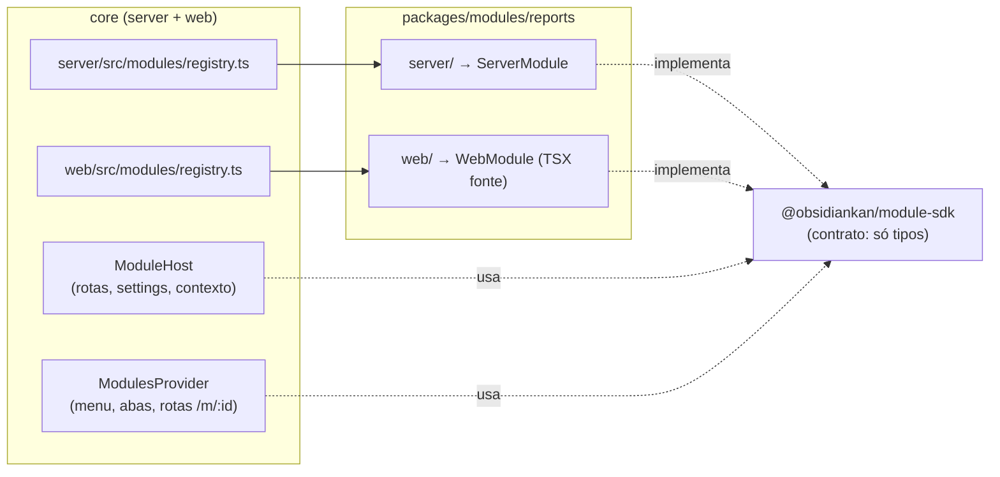
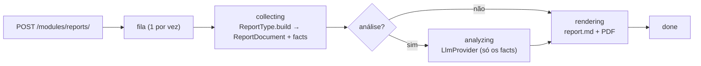

# Módulos opcionais — ObsidianKan

Funcionalidades que não fazem parte do núcleo (board, sprints, workflow) vivem como
**módulos**: pacotes do workspace com parte servidor e parte web, instalados no
código e ligados/desligados em runtime pela interface. O primeiro módulo é
**Relatórios** (`packages/modules/reports`).

O objetivo é o core continuar funcionando igual com o módulo desligado ou ausente
— e novos módulos (outros harnesses de LLM, integrações) entrarem sem editar o
core além de uma linha de registry.

---

## Visão geral



Regras:

- **O core só importa módulo nos dois arquivos de registry.** Todo o resto do core
  depende apenas de `@obsidiankan/module-sdk`.
- **O módulo nunca importa código do core.** Dados, LLM, rotas, eventos e
  componentes de UI chegam pelo contexto (`ModuleContext` no servidor,
  `ModuleHost` no web).
- **Instalado ≠ ativo.** Instalado = está no registry (código). Ativo = toggle em
  **Configs → Módulos**, persistido em `<vault>/.kanban/modules.json`. Módulo
  novo nasce **desativado**.
- **Desativar não reinicia nada nem apaga dados.** As rotas do módulo passam a
  responder 404 e ele some do menu na hora (evento SSE), em todas as abas abertas.
- **Um módulo quebrado não derruba o servidor.** Se `register()` lançar, o módulo
  fica com `load_error` (visível em Configs → Módulos) e fora do ar.

---

## Contrato — servidor

`packages/module-sdk/src/index.ts`:

```ts
export interface ServerModule {
  id: string            // kebab-case: prefixo de rota, pasta de dados, chave no modules.json
  name: string
  version: string
  description: string
  register(ctx: ModuleContext): void | Promise<void>
}
```

`register()` roda **uma vez no boot, sempre** (ativo ou não). O `ModuleContext` traz:

| Campo | O que é |
|---|---|
| `dataDir` | `<vault>/.kanban/modules/<id>/`, já criado. É do módulo — o core não lê. |
| `settings()` | `{ enabled, config }` atuais do `modules.json` (lidos a cada chamada). |
| `data` | Fachada **somente leitura**: `metrics`, `flow`, `digest`, `stalledReviews`, `listProjects`, `getProject`, `listCards`, `moves`. Tipos de `@obsidiankan/types`. |
| `llm` | `LlmProvider` genérico (ver abaixo). |
| `routes.register(method, pattern, auth, handler)` | Rota em `/modules/<id><pattern>`; `pattern` aceita `:param`. |
| `events.emit(event, payload)` | SSE `MODULE_EVENT` com `{ module: <id>, event, payload }`. |
| `logger` | pino com `module: <id>` no binding. |
| `env` | Variáveis de ambiente do processo. |

### Rotas

- `/modules` (GET) e `/modules/<id>` (GET/PUT) são **do core**: listar, ler, ligar/desligar
  e gravar config (PUT exige manager).
- Tudo abaixo de `/modules/<id>/` é **do módulo**.
- Postura de auth por rota: `lan` (sem token, só loopback/LAN, como `/metrics`), `bearer`
  (qualquer token), `pm` (agente pm ou manager), `manager`.
- Mutações (`POST/PUT/DELETE`) passam pela mesma proteção CSRF das tools
  (`content-type: application/json`, `Sec-Fetch-Site`, `Origin`).
- O handler devolve `{ status?, json }` ou `{ status?, file: { data, contentType, filename? } }`
  (binário, ex.: PDF). Para erro, lança `ModuleHttpError(status, body)`; qualquer outra
  exceção vira 500 sem vazar a mensagem.

### LLM

```ts
interface LlmProvider {
  readonly id: string              // 'claude-cli', 'stub', …
  readonly model: string | null
  complete(req: { prompt: string; resumeSessionId?: string | null; signal?: AbortSignal }): Promise<LlmCompletion>
}
```

Implementações em `packages/server/src/llm/`:

- `ClaudeCliProvider`: `claude -p` headless, sem MCP, sem `ANTHROPIC_API_KEY` (usa a conta
  logada). É a mesma lógica que já servia o wizard de planejamento —
  `planning/claude-runner.ts` virou um adapter fino sobre ele.
- `StubLlmProvider`: respostas sintéticas, instantâneas e gratuitas.

Cada módulo recebe o seu provider (`llm/factory.ts`), com cwd neutro em
`<dataDir>/llm`. Variáveis: `MODULES_LLM_STUB`, `MODULES_LLM_MODEL`,
`MODULES_LLM_TIMEOUT_MS` (ver [config](../reference/config.md)). Um adapter HTTP
(OpenAI-compatível) entra implementando a mesma interface.

---

## Contrato — web

`packages/module-sdk/web/index.ts` (consumido **como fonte** pelo Vite, sem build):

```ts
export interface WebModule {
  id: string
  page?: { navLabel: string; component: ComponentType<{ host: ModuleHost }> }            // /m/<id> + item no menu
  projectTab?: { label: string; component: ComponentType<{ host: ModuleHost; project: string }> } // /board/<p>/m/<id>
  settingsPanel?: ComponentType<{ host: ModuleHost }>                                      // Configs → Módulos
}

export interface ModuleHost {
  moduleId: string
  api: { fetch(path, init?): Promise<Response>; onEvent(handler): () => void }  // bearer + prefixo já aplicados
  ui: { Markdown; Dialog }                                                      // componentes do core
  config: Record<string, unknown>
  saveConfig(config): Promise<{ ok: true } | { ok: false; error: string }>
}
```

O módulo aparece na interface quando está no registry web **e** ativo no servidor,
sem `load_error`. As classes CSS globais do core (`detail`, `home-grid`, `banner`,
`empty-lg`, `label`, `field-help`, `pill`, `button.primary`…) e os tokens
(`--s-*`, `--fg-*`, `--ink-*`, `--accent`, `--run`…) fazem parte do contrato: o
módulo usa o mesmo vocabulário visual do resto da aplicação.

---

## Criar um módulo

1. `packages/modules/<id>/` com `package.json` (nome `@obsidiankan/module-<id>`),
   `tsconfig.json` (composite, NodeNext, `rootDir: server`, `outDir: dist/server`,
   referências a `../../shared` e `../../module-sdk`) e `exports`:
   `"."` → `dist/server/index.js`, `"./web"` → `web/index.tsx`.
   Use `packages/modules/reports` como molde.
2. `server/index.ts` exporta um `ServerModule`; `web/index.tsx` exporta um `WebModule`.
3. Instalar:
   - dependência `workspace:*` em `packages/server/package.json` e `packages/web/package.json`;
   - referência em `packages/server/tsconfig.json`;
   - uma linha em `packages/server/src/modules/registry.ts` e em `packages/web/src/modules/registry.ts`;
   - `pnpm install`.
4. `make server-restart` e ativar em **Configs → Módulos**.

Desinstalar é o caminho inverso; os dados em `.kanban/modules/<id>/` ficam (apague à mão
se quiser).

Testes do módulo ficam no próprio pacote (`tests/server` em node, `tests/web` com
`// @vitest-environment jsdom`), contra uma fachada de dados falsa — o módulo é
testável sem subir o core.

---

## Módulo Relatórios

`packages/modules/reports` — relatórios de **sprint**, de **projeto** (período) e do
**board** (todos os projetos), com números calculados, análise opcional por IA e PDF.



- **Um documento, duas saídas.** Cada tipo gera um `ReportDocument` (seções com blocos
  `kpis`, `table`, `chart`, `callout`, `list`, `paragraph`, `analysis`). O Markdown
  (`server/markdown.ts`, gráficos em mermaid `xychart-beta`) e o PDF (renderer Python)
  saem da mesma estrutura — os números nunca divergem.
- **Análise por IA só interpreta.** O prompt recebe apenas os `facts` já calculados, com a
  regra de não inventar número; o bloco sai rotulado como interpretação. Falha do LLM não
  derruba o relatório (sai sem a análise, com nota).
- **Progresso ao vivo.** Cada transição de status grava `report.json` e emite o evento
  `progress`; relatório interrompido por restart vira `failed` no boot seguinte.
- **Armazenamento:** `<vault>/.kanban/modules/reports/reports/<id>/` com `report.json`,
  `document.json`, `report.md`, `report.pdf`.

### PDF

`renderer/` é o pipeline do `geracao_reports` (Python + WeasyPrint + matplotlib) adaptado:
`brand.py` (paleta ObsidianKan, textos de marca por tema), `estilo.py` (CSS A4),
`paginas.py`, `figuras.py` (matplotlib → SVG inline), `compilar.py`, e `cli.py`, que lê
`{document, theme}` por stdin. Fontes (Outfit, Inter, JetBrains Mono — OFL) embutidas.

```bash
make reports-setup   # cria renderer/.venv com weasyprint + matplotlib
make reports-check   # confere o venv
```

Sem o venv o módulo funciona e gera Markdown; o PDF aparece como **indisponível** com o
motivo, e o botão "tentar PDF de novo" refaz só o PDF depois do setup.
`REPORTS_PYTHON` aponta outro interpretador.

O tema (marca, linha de apoio, tipo de documento, rodapé, site) é editado em
**Configs → Módulos → Relatórios** e fica em `modules.json` (`config.theme`).

### Definições dos números

| Número | Definição |
|---|---|
| Entrega | Último MOVE do card para `done` dentro do período (card refeito conta uma vez) |
| Tempo de ciclo | Primeiro MOVE para `in_progress` até `done` (mesma regra do `FlowService`) |
| Retrabalho | Transições para coluna anterior, pela ordem de colunas do projeto |
| Custo | `token_log` (medido) — da sprint por `sprint_id`, do projeto por `project`; inclui rodadas dos agentes do workflow |
| Terminal | Estimado por tabela de preço; aparece à parte, nunca somado ao custo do board |

Cards arquivados entram no relatório de sprint e nas entregas: o fechamento de sprint
arquiva o que foi concluído.
