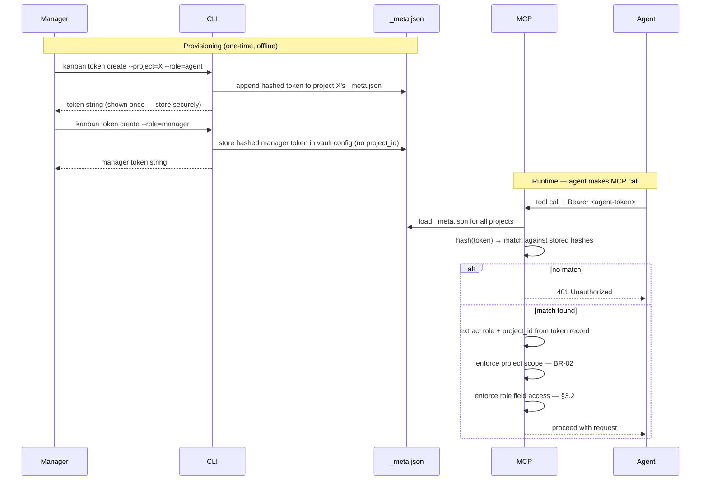

# 3. User Roles and Permissions

### 3.1  Role Matrix
| Action | Manager | Agent |
| --- | --- | --- |
| Create card | Via plugin board (→ MCP) or directly creating .md file | Via MCP only |
| Read card | Direct file or plugin board | Via MCP only |
| Edit card content (body, allowed fields) | Obsidian editor directly or via plugin | Via MCP only (agent-writable fields) |
| Edit immutable fields (id, project, etc.) | Silently reverted by file watcher | Not applicable — MCP rejects |
| Move card (status change) | Drag in plugin board (→ MCP) or edit status field directly | Via kanban_move_card |
| Reorder cards | Drag in plugin board (→ MCP) | Via kanban_reorder_card |
| Hard delete card | Yes (delete file) | Never |
| Create / configure project | Yes (CLI + plugin) | No |
| Token provisioning | Yes (CLI) | No |

### 3.2  Token Structure
There are two distinct token types, differing in scope:

| Claim | Agent Token | Manager Token |
| --- | --- | --- |
| `role` | `agent` | `manager` |
| `project_id` | Required — bound to exactly one project at issuance, immutable | Absent — manager token is project-unscoped (access to all projects in the vault) |

Agent tokens are issued per project and scoped to it. Manager tokens are issued once per vault and grant access to all projects. Both use the same MCP endpoints — `role` is the enforcement boundary for field-level access control. Manager tokens are never shared with agents.

### 3.3  Agent Constraints
- Each agent token is bound to exactly one project_id at issuance. Immutable.
- project_id from token cannot be overridden by any request parameter.
- Requests with fields outside the agent-writable set are rejected with 400 and an explicit disallowed_fields list.
- Agents cannot hard-delete cards. Terminal agent-accessible state is 'archived'.
- Agents receive 404 for other projects' cards — identical to not-found.

### 3.5  Token Provisioning and Validation Flow

### 3.4  Human Edit Expectations
- Humans can freely edit the body (Markdown below the frontmatter separator) with no restrictions.
- Humans can edit mutable frontmatter fields (title, status, priority, tags, due_date, assigned_to, owner, agent_notes) directly.
- Changes to immutable fields (id, project, version, created_at, created_by) are silently reverted. A FIELD_REVERTED entry is written to the audit log.
- The plugin collapses the frontmatter block by default and shows an advisory banner to reduce accidental edits.

