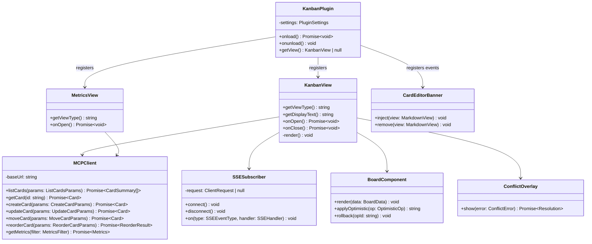

```mermaid
classDiagram
    class MCPServer {
        +start(vaultPath: string) void
        +stop() void
    }

    class RequestRouter {
        +dispatch(tool: string, params: unknown, ctx: RequestContext) Promise~Response~
    }

    class TokenValidator {
        +validate(bearerToken: string, vaultPath: string) Promise~TokenClaims~
    }

    class IdempotencyChecker {
        +check(requestId: string) CachedResponse | null
        +store(requestId: string, response: Response) void
        +cleanup() void
    }

    class CardService {
        +create(params: CreateCardParams, ctx: TokenClaims) Promise~Card~
        +update(params: UpdateCardParams, ctx: TokenClaims) Promise~Card~
        +move(params: MoveCardParams, ctx: TokenClaims) Promise~Card~
        +reorder(params: ReorderCardParams, ctx: TokenClaims) Promise~ReorderResult~
    }

    class QueryService {
        +list(params: ListCardsParams, ctx: TokenClaims) Promise~CardSummary[]~
        +get(id: string, ctx: TokenClaims) Promise~Card~
    }

    class FileWatcherService {
        +start(dataPath: string) void
        +stop() void
        -onFileChange(filePath: string) Promise~void~
    }

    class ReconciliationService {
        +run(vaultPath: string) Promise~ReconciliationReport~
    }

    class SQLiteRepository {
        +findByProject(projectId: string, filter: CardFilter) CardSummary[]
        +findById(id: string) CardSummary | null
        +getVersion(id: string) number | null
        +insert(card: Card, fileHash: string) void
        +update(card: Card, fileHash: string) void
        +delete(id: string) void
    }

    class AtomicWriter {
        +write(filePath: string, content: string, cardId: string) Promise~void~
        +isOriginated(cardId: string) boolean
    }

    class AuditLogger {
        +log(entry: AuditEntry) void
    }

    class SSEEventBus {
        +subscribe(res: ServerResponse) void
        +unsubscribe(res: ServerResponse) void
        +emit(event: SSEEvent) void
    }

    MCPServer --> RequestRouter
    MCPServer --> FileWatcherService
    MCPServer --> ReconciliationService
    MCPServer --> SSEEventBus

    RequestRouter --> TokenValidator
    RequestRouter --> IdempotencyChecker
    RequestRouter --> CardService
    RequestRouter --> QueryService

    CardService --> AtomicWriter
    CardService --> SQLiteRepository
    CardService --> AuditLogger
    CardService --> SSEEventBus

    QueryService --> SQLiteRepository
    QueryService --> AtomicWriter

    FileWatcherService --> AtomicWriter
    FileWatcherService --> SQLiteRepository
    FileWatcherService --> AuditLogger

    ReconciliationService --> SQLiteRepository
    ReconciliationService --> AtomicWriter
```

# Sprint 00 — Design & Architecture

**Objetivo:** Produzir a documentação técnica de design antes de qualquer implementação — class diagrams dos dois subsistemas (MCP Server e Obsidian Plugin) e interfaces TypeScript normativas. Sprint 00 não produz código executável; produz os contratos de design que guiam todos os sprints de implementação.

**Critério de encerramento:** `docs/design/` contém os três artefatos (mcp-server.md, plugin.md, interfaces.ts) sem contradição com o PRD. Interfaces TypeScript compilam sem erro (`tsc --noEmit`).

**Pré-requisito:** PRD §3–§11 estável. (Concluído.)

---

## Tasks

| ID | Título | Tipo |
|---|---|---|
| TASK-D01 | Class diagram — MCP Server | `design` |
| TASK-D02 | Class diagram — Obsidian Plugin | `design` |
| TASK-D03 | TypeScript interfaces normativas | `design` |
| TASK-D04 | Revisão cruzada dos designs com o PRD | `review` |

---

## Task Details

### TASK-D01: Class diagram — MCP Server

**Tipo:** `design`

**Artefato de saída:** `docs/design/mcp-server.md`

**Descrição:**
Modelar as classes e responsabilidades internas do MCP Server conforme §4.6 do PRD. O diagrama deve refletir as dependências reais entre módulos — cada seta representa uma dependência direta de construção (injeção ou instanciação).

**Regras de design:**
- `CardService` é o único ponto de escrita de cards — `FileWatcherService` delega a ele
- `AtomicWriter` controla o flag `MCP-originated` — é a única classe que conhece esse mecanismo
- `SSEEventBus` é emitido apenas por `CardService` — nunca diretamente por outros serviços
- `SQLiteRepository` é acessado por `CardService`, `QueryService`, `FileWatcherService` e `ReconciliationService`

**Class diagram esperado:**



**Definition of Done:**
- `docs/design/mcp-server.md` criado com o class diagram acima
- Cada classe tem responsabilidade única documentada em um parágrafo
- Nenhuma dependência circular entre classes
- Todas as classes do §4.6 estão representadas

**Testes:**
- Revisar cada seta do diagrama: a classe origem instancia ou recebe por injeção a classe destino?
- Verificar que `FileWatcherService` não escreve arquivos diretamente (delega para `CardService`)
- Verificar que `SSEEventBus` não é dependência de `FileWatcherService` (eventos SSE vêm só do `CardService`)

**Execução** _(preencher ao concluir)_
- Agente:
- Input tokens:
- Output tokens:
- Observações:

---

### TASK-D02: Class diagram — Obsidian Plugin

**Tipo:** `design`

**Artefato de saída:** `docs/design/plugin.md`

**Descrição:**
Modelar as classes do plugin Obsidian conforme §11 do PRD e as regras RULE-01 a RULE-10. O diagrama deve refletir as restrições de lifecycle — views nunca são campos da classe `KanbanPlugin` (RULE-04).

**Regras de design:**
- `KanbanPlugin` nunca armazena referências diretas a views (RULE-04)
- `SSESubscriber` registra eventos via `registerEvent` / `registerDomEvent` (RULE-02)
- `MCPClient` usa `http.request` do Node.js — não `fetch` (necessário para SSE)
- `ConflictOverlay` é instanciado sob demanda — não mantido como estado global

**Class diagram esperado:**



**Definition of Done:**
- `docs/design/plugin.md` criado com o class diagram acima
- `KanbanPlugin` não tem campo de view — `getView()` recupera sob demanda via workspace
- `SSESubscriber` documentado como usando `http.request` (não `EventSource`) por compatibilidade Node.js
- Referências cruzadas com RULE-02, RULE-04 documentadas junto ao diagrama

**Testes:**
- Confirmar que `KanbanPlugin` não tem campo `view: KanbanView` ou similar
- Confirmar que `ConflictOverlay` não é campo de nenhuma classe — instanciado sob demanda
- Verificar que `CardEditorBanner` é conectado via `registerEvent` (sem `addEventListener` direto)

**Execução** _(preencher ao concluir)_
- Agente:
- Input tokens:
- Output tokens:
- Observações:

---

### TASK-D03: TypeScript interfaces normativas

**Tipo:** `design`

**Artefato de saída:** `docs/design/interfaces.ts`

**Descrição:**
Definir os tipos TypeScript que formam o contrato entre MCP Server, plugin e agentes. Esses tipos são a fonte de verdade para implementação — qualquer divergência com o PRD §5 e §6 é um bug de design.

**Interfaces esperadas:**

```typescript
// ─── Domain ───────────────────────────────────────────────────────────────────

export interface Card {
  id: string                   // card-{nanoid(8)} — imutável
  project: string              // folder name — imutável
  title: string                // max 200 chars
  status: string               // must match _meta.json columns
  type: string                 // imutável após criação
  version: number              // incrementado a cada write
  position: number             // único por (project, status)
  priority: 'low' | 'medium' | 'high' | 'critical'
  tags: string[]               // max 20 items, max 50 chars each
  due_date: string | null      // YYYY-MM-DD
  assigned_to: string | null
  owner: string | null         // somente manager pode escrever
  agent_notes: string | null   // max 2000 chars
  total_input_tokens: number   // acumulado — nunca decrementado
  total_output_tokens: number  // acumulado — nunca decrementado
  created_at: string           // ISO 8601 — imutável
  updated_at: string           // ISO 8601 — MCP-managed
  created_by: string           // agent:|human:|external:
  updated_by: string           // agent:|human:|external:
  body?: string                // presente apenas em kanban_get_card
}

export type CardSummary = Omit<Card, 'body'>

// ─── Token ────────────────────────────────────────────────────────────────────

export interface AgentToken {
  role: 'agent'
  project_id: string
  actor: string
}

export interface ManagerToken {
  role: 'manager'
  actor: string
  // sem project_id — acesso a todos os projetos do vault
}

export type TokenClaims = AgentToken | ManagerToken

// ─── MCP API Params ───────────────────────────────────────────────────────────

export interface TokenFields {
  input_tokens: number
  output_tokens: number
  model: string
}

export interface CreateCardParams extends TokenFields {
  title: string
  type: string
  status?: string
  priority?: 'low' | 'medium' | 'high' | 'critical'
  tags?: string[]
  due_date?: string
  assigned_to?: string
  body?: string
  agent_notes?: string
  request_id?: string
}

export interface UpdateCardParams extends TokenFields {
  id: string
  version: number
  title?: string
  status?: string       // status change aplica mesma lógica de position do move_card (§5.4)
  priority?: 'low' | 'medium' | 'high' | 'critical'
  tags?: string[]
  due_date?: string | null
  assigned_to?: string | null
  agent_notes?: string
  body?: string
  owner?: string        // manager only
  request_id?: string
}

export interface MoveCardParams extends TokenFields {
  id: string
  version: number
  to_status: string
  request_id?: string
}

export interface ReorderCardParams extends TokenFields {
  id: string
  version: number
  after_card_id: string | null
  request_id?: string
}

export interface ListCardsParams {
  status?: string
  tags?: string[]
  assigned_to?: string
  limit?: number        // default 50, max 200
  offset?: number       // default 0
  order_by?: 'position' | 'updated_at' | 'priority' | 'due_date'
}

export interface ReorderResult {
  card: Card
  affected_cards: Array<{ id: string; new_version: number; new_position: number }>
}

// ─── SSE Events ───────────────────────────────────────────────────────────────

export type SSEEventType =
  | 'CARD_CREATED'
  | 'CARD_UPDATED'
  | 'CARD_MOVED'
  | 'CARD_REORDERED'
  | 'CARD_HUMAN_EDITED'
  | 'CARD_DELETED'

export interface CardCreatedPayload    { card_id: string; project: string; status: string; position: number }
export interface CardUpdatedPayload    { card_id: string; project: string; changed_fields: string[] }
export interface CardMovedPayload      { card_id: string; project: string; from_status: string; to_status: string; new_position: number }
export interface CardReorderedPayload  { project: string; status: string; affected_cards: Array<{ id: string; new_position: number }> }
export interface CardHumanEditedPayload { card_id: string; project: string; new_version: number }
export interface CardDeletedPayload    { card_id: string; project: string }

export type SSEEventPayload =
  | CardCreatedPayload
  | CardUpdatedPayload
  | CardMovedPayload
  | CardReorderedPayload
  | CardHumanEditedPayload
  | CardDeletedPayload

export interface SSEEvent {
  type: SSEEventType
  payload: SSEEventPayload
}

export type SSEHandler<T extends SSEEventPayload = SSEEventPayload> = (payload: T) => void

// ─── Audit ────────────────────────────────────────────────────────────────────

export type AuditOp =
  | 'CREATE' | 'UPDATE' | 'MOVE' | 'REORDER'
  | 'HUMAN_EDIT' | 'FIELD_REVERTED' | 'PARSE_ERROR'
  | 'RECONCILED' | 'ORPHAN_REMOVED' | 'SQLITE_REBUILT' | 'EXTERNAL_MUTATION'

export interface AuditEntry {
  ts: string
  op: AuditOp
  project?: string
  card_id?: string
  version?: number
  actor?: string
  // presentes apenas em ops MCP mutantes (CREATE, UPDATE, MOVE, REORDER):
  input_tokens?: number
  output_tokens?: number
  model?: string
  // específicos por op:
  changed_fields?: string[]    // UPDATE
  from_status?: string         // MOVE
  to_status?: string           // MOVE
  affected_cards?: string[]    // REORDER
  field?: string               // FIELD_REVERTED
  reason?: string              // FIELD_REVERTED, PARSE_ERROR
  card_count?: number          // SQLITE_REBUILT
}

// ─── Error Responses ──────────────────────────────────────────────────────────

export interface ConflictError {
  error: 'conflict'
  message: string
  your_version: number
  current_version: number
  conflicting_fields: string[]
  current_card: Card
}

export interface ValidationError {
  error: 'invalid_fields'
  message: string
  disallowed_fields: string[]
  allowed_fields: string[]
}

// ─── Plugin-specific ──────────────────────────────────────────────────────────

export type Resolution = 'keep-mine' | 'keep-theirs' | 'manual'

export interface OptimisticOp {
  id: string
  type: 'move' | 'create' | 'reorder'
  snapshot: BoardData
}

export interface BoardData {
  projects: Array<{
    id: string
    columns: string[]
    cards: Record<string, CardSummary[]>  // status → cards ordered by position
  }>
}

export interface MetricsFilter {
  from_date?: string
  to_date?: string
}

export interface Metrics {
  summary: { total_input_tokens: number; total_output_tokens: number; total_ops: number }
  by_type: Array<{ type: string; input_tokens: number; output_tokens: number; ops: number }>
  by_day: Array<{ date: string; input_tokens: number; output_tokens: number }>
  by_model: Array<{ model: string; input_tokens: number; output_tokens: number }>
  by_agent: Array<{ actor: string; input_tokens: number; output_tokens: number }>
  by_operation: Array<{ op: string; input_tokens: number; output_tokens: number; count: number }>
}
```

**Definition of Done:**
- `docs/design/interfaces.ts` criado com todos os tipos acima
- `tsc --noEmit docs/design/interfaces.ts` sem erros
- `TokenClaims` é union discriminada — `role` é o discriminante
- `UpdateCardParams.status` tem comentário referenciando §5.4 (position logic)
- Todas as SSEEventPayload types mapeiam 1:1 com os 6 event types de §6.10

**Testes:**
- `tsc --noEmit --strict docs/design/interfaces.ts` → zero erros
- Verificar que `Card.body` é optional (ausente em list, presente em get)
- Verificar que `ManagerToken` não tem `project_id` — diferença estrutural de `AgentToken`

**Execução** _(preencher ao concluir)_
- Agente:
- Input tokens:
- Output tokens:
- Observações:

---

### TASK-D04: Revisão cruzada dos designs com o PRD

**Tipo:** `review`

**Descrição:**
Verificar que os três artefatos produzidos (TASK-D01, D02, D03) são consistentes entre si e com o PRD. Esta task não produz artefatos novos — apenas valida e documenta inconsistências encontradas na seção de Observações.

**Checklist de revisão:**

| # | Verificação | Referência |
|---|---|---|
| R-01 | `TokenClaims` union cobre agent (project-scoped) e manager (unscoped) | §3.2 |
| R-02 | `CardService.move()` e `CardService.update()` aplicam mesma lógica de position em status change | §5.4, §6.5 |
| R-03 | `AtomicWriter.isOriginated()` é o único mecanismo de flag MCP-originated — usado por `FileWatcherService` | §7.4 |
| R-04 | `SSEEventBus.emit()` é chamado apenas por `CardService` — `FileWatcherService` não emite diretamente | §6.10 |
| R-05 | Os 6 `SSEEventType` batem exatamente com os 6 events de §6.10 | §6.10 |
| R-06 | `KanbanPlugin.getView()` recupera via workspace — sem campo direto de view | RULE-04 |
| R-07 | `SSESubscriber` usa `http.request` do Node.js — compatível com stdio MCP | RULE-01, §11.1 |
| R-08 | `AuditEntry` cobre todos os 11 `AuditOp` types de TASK-16 | Sprint 02 TASK-16 |
| R-09 | `UpdateCardParams` não inclui `type`, `position`, `version` como campos editáveis | §6.5 |
| R-10 | `MetricsFilter` e `Metrics` batem com o schema de `GET /metrics` (TASK-31) | Sprint 03 TASK-31 |

**Definition of Done:**
- Todos os 10 itens do checklist verificados com status explícito (pass/fail)
- Qualquer fail documentado em Observações com a correção aplicada nos artefatos

**Execução** _(preencher ao concluir)_
- Agente:
- Input tokens:
- Output tokens:
- Observações:
